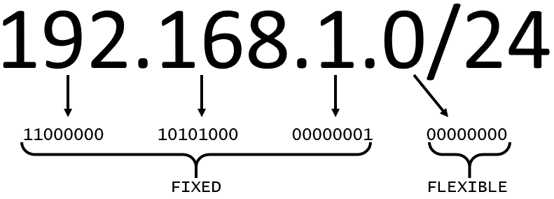

# Index
- [Index](#index)
- [Basics](#basics)
  - [AWS Business Model](#aws-business-model)
  - [What is Cloud Computing](#what-is-cloud-computing)
  - [Cloud Computing Models](#cloud-computing-models)
    - [In terms of Services offered](#in-terms-of-services-offered)
      - [Infrastructure as a Service (IaaS)](#infrastructure-as-a-service-iaas)
      - [Platform as a Service (PaaS)](#platform-as-a-service-paas)
      - [Software as a Service (SaaS)](#software-as-a-service-saas)
    - [In terms of deployment](#in-terms-of-deployment)
      - [Cloud](#cloud)
      - [Hybrid](#hybrid)
      - [On-premises](#on-premises)
- [Some of the advantages of AWS](#some-of-the-advantages-of-aws)
- [Common Amazon Services](#common-amazon-services)
  - [Compute](#compute)
  - [AWS Data-Storage](#aws-data-storage)
    - [AWS Storage](#aws-storage)
    - [AWS Databases](#aws-databases)
  - [Networking](#networking)
  - [Analytics](#analytics)
  - [Blockchain](#blockchain)
  - [Containers](#containers)
  - [Machine Learning](#machine-learning)
  - [IOT](#iot)
- [Overview of an app on AWS](#overview-of-an-app-on-aws)
- [Global Infrastructure of AWS](#global-infrastructure-of-aws)
  - [Availability Zone](#availability-zone)
  - [Region](#region)
    - [How to chose region](#how-to-chose-region)
- [Interacting with AWS](#interacting-with-aws)
  - [Security and AWS Shared Responsibility Model](#security-and-aws-shared-responsibility-model)
    - [AWS responsibility](#aws-responsibility)
    - [Customer responsibility](#customer-responsibility)
  - [Root User](#root-user)
    - [Access Keys](#access-keys)
    - [MFA](#mfa)
  - [IAM](#iam)
    - [Credentials](#credentials)
    - [IAM Group](#iam-group)
    - [IAM policies](#iam-policies)
    - [Policy Structure](#policy-structure)
  - [Important IAM best practices](#important-iam-best-practices)
    - [Lock down the AWS root user](#lock-down-the-aws-root-user)
    - [Principle of least privilege](#principle-of-least-privilege)
    - [Use IAM appropriately](#use-iam-appropriately)
    - [Use IAM roles when Possible](#use-iam-roles-when-possible)
    - [Consider using a Identity Provider](#consider-using-a-identity-provider)
    - [Consider AWS Single Sign-On](#consider-aws-single-sign-on)
  - [Key Takeaway](#key-takeaway)
- [AWS Compute](#aws-compute)
  - [Amazon Elastic Compute Cloud, EC2](#amazon-elastic-compute-cloud-ec2)
    - [Amazon Machine Image](#amazon-machine-image)
    - [Relationship between AMIs and EC2 instances](#relationship-between-amis-and-ec2-instances)
    - [AMI categories](#ami-categories)
    - [EC2 Instance](#ec2-instance)
      - [Amazon EC2 instance types](#amazon-ec2-instance-types)
      - [Instance families](#instance-families)
      - [EC2 instance locations](#ec2-instance-locations)
      - [Architect for high availability](#architect-for-high-availability)
      - [EC2 instance lifecycle](#ec2-instance-lifecycle)
      - [Difference between stop and stop-hibernate](#difference-between-stop-and-stop-hibernate)
      - [Price](#price)
      - [Pay as you go with On-Demand Instances](#pay-as-you-go-with-on-demand-instances)
      - [Reserve capacity with Reserved Instances (RIs)](#reserve-capacity-with-reserved-instances-ris)
      - [Save on costs with Spot Instances](#save-on-costs-with-spot-instances)
  - [Container Services](#container-services)
    - [Containers](#containers-1)
    - [Docker](#docker)
    - [Difference between containers and virtual machines (VMs)](#difference-between-containers-and-virtual-machines-vms)
    - [Orchestrate containers](#orchestrate-containers)
    - [Manage containers with Amazon Elastic Container Service (Amazon ECS)](#manage-containers-with-amazon-elastic-container-service-amazon-ecs)
    - [Use Kubernetes with Amazon Elastic Kubernetes Service (Amazon EKS)](#use-kubernetes-with-amazon-elastic-kubernetes-service-amazon-eks)
  - [Serverless and Lambda](#serverless-and-lambda)
    - [Remove the undifferentiated heavy lifting](#remove-the-undifferentiated-heavy-lifting)
    - [Go serverless](#go-serverless)
    - [Explore serverless containers with AWS Fargate](#explore-serverless-containers-with-aws-fargate)
    - [Run code on AWS Lambda](#run-code-on-aws-lambda)
    - [How AWS Lambda works](#how-aws-lambda-works)
    - [AWS Lambda function handler](#aws-lambda-function-handler)
    - [Naming](#naming)
    - [Billing granularity](#billing-granularity)
    - [Source code](#source-code)
- [Networking](#networking-1)
  - [Networking basics](#networking-basics)
    - [IP addresses](#ip-addresses)
    - [IPv4 notation](#ipv4-notation)
    - [CIDR notation](#cidr-notation)
  - [Amazon Virtual Private Cloud](#amazon-virtual-private-cloud)
    - [Create a subnet](#create-a-subnet)
    - [High availability with a VPC](#high-availability-with-a-vpc)
    - [Reserved IPs](#reserved-ips)
    - [Gateways](#gateways)
      - [Internet gateway](#internet-gateway)
      - [Virtual private gateway](#virtual-private-gateway)
  - [VPC Routing](#vpc-routing)
    - [Main route table](#main-route-table)
    - [Custom route tables](#custom-route-tables)
  - [VPC Security](#vpc-security)
    - [Secure subnets with network access control lists](#secure-subnets-with-network-access-control-lists)
    - [Secure EC2 instances with security groups](#secure-ec2-instances-with-security-groups)
- [Storage](#storage)
  - [Types](#types)
    - [File Storage](#file-storage)
    - [Block storage](#block-storage)
    - [Object storage](#object-storage)
    - [Relate back to traditional storage systems](#relate-back-to-traditional-storage-systems)
  - [EC2 instance store and Block Storage](#ec2-instance-store-and-block-storage)
    - [Amazon Elastic Block Storage (Amazon EBS)](#amazon-elastic-block-storage-amazon-ebs)
    - [Scale Amazon EBS volumes](#scale-amazon-ebs-volumes)
    - [Amazon EBS use cases](#amazon-ebs-use-cases)
    - [Amazon EBS volume types](#amazon-ebs-volume-types)
    - [Amazon EBS benefits](#amazon-ebs-benefits)
    - [Amazon EBS snapshots](#amazon-ebs-snapshots)
  - [Amazon S3](#amazon-s3)
    - [Amazon S3 concepts](#amazon-s3-concepts)
    - [Amazon S3 use cases](#amazon-s3-use-cases)
    - [Choose the right connectivity option for resources](#choose-the-right-connectivity-option-for-resources)
    - [IAM policies](#iam-policies-1)
    - [S3 bucket policies](#s3-bucket-policies)
    - [Amazon S3 encryption](#amazon-s3-encryption)
    - [Amazon S3 versioning](#amazon-s3-versioning)
    - [Versioning states](#versioning-states)
    - [Six Amazon S3 storage classes](#six-amazon-s3-storage-classes)
    - [Automate tier transitions with object lifecycle management](#automate-tier-transitions-with-object-lifecycle-management)
  - [Choose the Right Storage Service](#choose-the-right-storage-service)
    - [Amazon EC2 instance store](#amazon-ec2-instance-store)
    - [Amazon EBS](#amazon-ebs)
    - [Amazon S3](#amazon-s3-1)
    - [Amazon Elastic File System (Amazon EFS) and Amazon FSx](#amazon-elastic-file-system-amazon-efs-and-amazon-fsx)
- [Databases on AWS](#databases-on-aws)
  - [History behind enterprise databases](#history-behind-enterprise-databases)
  - [Relational databases](#relational-databases)
  - [Relational database management system](#relational-database-management-system)
  - [Relational database benefits](#relational-database-benefits)
  - [Relational database use cases](#relational-database-use-cases)
  - [Choose between unmanaged and managed databases](#choose-between-unmanaged-and-managed-databases)
    - [On-premises database](#on-premises-database)
    - [Unmanaged database](#unmanaged-database)
    - [Managed database](#managed-database)
  - [Amazon Relational Database Service](#amazon-relational-database-service)
    - [Amazon RDS](#amazon-rds)
    - [DB instances](#db-instances)
    - [Amazon RDS in an Amazon Virtual Private Cloud](#amazon-rds-in-an-amazon-virtual-private-cloud)
    - [Secure Amazon RDS with AWS Identity and Access Management (IAM)](#secure-amazon-rds-with-aws-identity-and-access-management-iam)
      - [Backup data](#backup-data)
      - [Automatic backups](#automatic-backups)
      - [Manual snapshots](#manual-snapshots)
    - [Backup options](#backup-options)
    - [Redundancy with Amazon RDS Multi-AZ](#redundancy-with-amazon-rds-multi-az)
  - [Purpose built databases](#purpose-built-databases)
  - [Amazon DynamoDB](#amazon-dynamodb)
    - [Amazon DynamoDB introduction](#amazon-dynamodb-introduction)
    - [Amazon DynamoDB core components](#amazon-dynamodb-core-components)
    - [Amazon DynamoDB security](#amazon-dynamodb-security)
  - [Choose the Right Database Service](#choose-the-right-database-service)
    - [AWS database services](#aws-database-services)
    - [Breaking up applications and databases](#breaking-up-applications-and-databases)
- [Subtleties](#subtleties)
  - [IAM User vs IAM Role](#iam-user-vs-iam-role)

# Basics

## AWS Business Model

> Less I use the less I pay, the more I use the less I pay per unit

## What is Cloud Computing 

> Cloud computing is the on-demand delivery of IT resources over the Internet with pay-as-you-go pricing

## Cloud Computing Models

### In terms of Services offered

#### Infrastructure as a Service (IaaS)

#### Platform as a Service (PaaS)

#### Software as a Service (SaaS)

### In terms of deployment 

#### Cloud
#### Hybrid
#### On-premises


# Some of the advantages of AWS

- **Trade fixed expense for variable expense** – Instead of having to invest heavily in data centers and servers before you know how you’re going to use them, you can pay only when you consume computing resources, and pay only for how much you consume.

- **Benefit from massive economies of scale** – By using cloud computing, you can achieve a lower variable cost than you can get on your own. Because usage from hundreds of thousands of customers is aggregated in the cloud, providers such as AWS can achieve higher economies of scale, which translates into lower pay as-you-go prices.

- **Stop guessing capacity** – Eliminate guessing on your infrastructure capacity needs. When you make a capacity decision prior to deploying an application, you often end up either sitting on expensive idle resources or dealing with limited capacity. With cloud computing, these problems go away. You can access as much or as little capacity as you need, and scale up and down as required with only a few minutes’ notice.

- **Increase speed and agility** – In a cloud computing environment, new IT resources are only a click away, which means that you reduce the time to make those resources available to your developers from weeks to just minutes. This results in a dramatic increase in agility for the organization, since the cost and time it takes to experiment and develop is significantly lower.

- **Stop spending money running and maintaining data centers** – Focus on projects that differentiate your business, not the infrastructure. Cloud computing lets you focus on your own customers, rather than on the heavy lifting of racking, stacking, and powering servers.

- **Go global in minutes** – Easily deploy your application in multiple regions around the world with just a few clicks. This means you can provide lower latency and a better experience for your customers at minimal cost.


# Common Amazon Services

## Compute
- EC2
- AWS Lambda
- Amazon Lightsail
- Batch
- Elastic Beanstalk
- Serverless Application Repository

## AWS Data-Storage
AWS data-storage services are grouped into two main service groups: 
- AWS storage 
- AWS database.

### AWS Storage
- Amazon S3
- EBS
- S3 Glacier
- Elastic File Storage
- EBS

### AWS Databases
- Amazon RDS
- DynamoDB
- Redshift

## Networking
- Amazon VPC
- Amazon Route 53
- Elastic Load Balancing

## Analytics
## Blockchain
## Containers
## Machine Learning
## IOT


# Overview of an app on AWS

- Application is built in private network Amazon VPC (Virtual Private Cloud)
- Backend code is hosted on Amazon EC2 (Elastic Computer Cloud), it provides computing power/resources
- Users data is hosted on either Amazon RDS (Relational Database Service) DB Instance or Amazon DynamoDB
- Images will be stored in object storage service Amazon S3 (Simple Storage Service)
- To make application scalable and fault tolerant ELB (Elastic Load Balancer) is used
  - It distributes traffic across the EC2 instances
- Amazon EC2 autoscaling is used to scale down or scale up according to the demand
- For security and Identity we can use AWS IAM (Identity and Access Management)
- Amazon CloudWatch is used for monitoring the solution


# Global Infrastructure of AWS

## Availability Zone

- Cluster of data centers (1 or more data center(s)) with redundant power, networking, connectivity and data are called `Availability Zone`
- AZ is there to deal with natural disasters, if one data center goes down other should be there
- AZs also have a code name. Since they are located inside Regions, they can be addressed by appending a letter to the end of the Region code name
  - **sa-east-1b:** An AZ in sa-east-1 (São Paulo Region)

## Region
- Cluster of AZ's with Redundant high speed and low latency links is called `Region`
- Regions are generally named by location
- Each AWS Region is associated with a geographical name and a Region code.
  -  ap-northeast-1: The first Region created in the northeast Asia Pacific area. The geographical name for this Region is Tokyo.
-  AWS Regions are independent from one another. Data is not replicated from one Region to another, without explicit customer consent and authorization.

> A well-known best practice for cloud architecture is to use Region-scoped, managed services

### How to chose region

You should see these 4 things

- Compliance
  - Some countries or higher authorities requires companies to handle data in certain way, they might not allow to store their data in countries they don't have good relations with
- Latency
  - Distance of data centers from the users of data can affect latency
- Price
  - Data centers in some regions can be expensive than others due to the economy/tax structure
- Service Availability


# Interacting with AWS

Every action you make in AWS is an API call that is authenticated and authorized

- The AWS Management Console
- The AWS Command Line Interface (AWS CLI)
- AWS SDKs

## Security and AWS Shared Responsibility Model

managing security and compliance is a shared responsibility between AWS and you. To depict this shared responsibility, AWS created the shared responsibility model. The distinction of responsibility is commonly referred to as security OF the cloud versus security IN the cloud. 


### AWS responsibility


> The level of responsibility AWS has depends on the service. AWS classifies services into three categories.

<table style="width:100%;"><thead><tr><th style="width:20.9388%;background-color:rgb(0, 82, 118);"><span style="color:rgb(255, 255, 255);font-weight:bold;">Category</span></th><th style="width:42.4894%;background-color:rgb(0, 82, 118);"><span style="color:rgb(255, 255, 255);font-weight:bold;">Examples of AWS Services in the Category&nbsp;</span></th><th style="width:36.4856%;background-color:rgb(0, 82, 118);"><span style="color:rgb(255, 255, 255);font-weight:bold;">AWS Responsibility&nbsp;</span></th></tr></thead><tbody><tr><td style="text-align:center;width:20.9388%;"><span>Infrastructure services&nbsp;</span></td><td style="text-align:center;width:42.4894%;"><span>Compute services, such as Amazon Elastic Compute Cloud (Amazon EC2)&nbsp;</span></td><td style="text-align:center;width:36.4856%;"><span>AWS manages the underlying infrastructure and foundation services.&nbsp;</span></td></tr><tr><td style="text-align:center;width:20.9388%;"><span>Container services&nbsp;</span></td><td style="text-align:center;width:42.4894%;"><span>Services that require less management from the customer, such as Amazon Relational Database Service (Amazon RDS)&nbsp;</span></td><td style="text-align:center;width:36.4856%;"><span>AWS manages the underlying infrastructure and foundation services, operating system, and application platform.&nbsp;</span></td></tr><tr><td style="text-align:center;width:20.9388%;">Abstracted services<br></td><td style="text-align:center;width:42.4894%;">Services that require very little management from the customer, such as Amazon Simple Storage Service (Amazon S3)<br></td><td style="text-align:center;width:36.4856%;">AWS operates the infrastructure layer, operating system, and platforms, in addition to server-side encryption and data protection.<br></td></tr>

### Customer responsibility

<div class="rise-table-wrap"><table style="width:100%;"><thead><tr><th style="width:22.9099%;background-color:rgb(0, 82, 118);"><span style="color:rgb(255, 255, 255);font-weight:bold;">Category</span></th><th style="width:39.0728%;background-color:rgb(0, 82, 118);"><span style="color:rgb(255, 255, 255);font-weight:bold;">AWS Responsibility&nbsp;</span></th><th style="width:37.7997%;background-color:rgb(0, 82, 118);"><span style="color:rgb(255, 255, 255);font-weight:bold;">Customer Responsibility&nbsp;</span></th></tr></thead><tbody><tr><td style="text-align:center;width:22.9099%;"><span>Infrastructure services&nbsp;</span></td><td style="text-align:center;width:39.0728%;"><span>AWS manages the infrastructure and foundation services.&nbsp;</span></td><td style="text-align:center;width:37.7997%;"><span>You control the operating system and application platform, in addition to encrypting, protecting, and managing customer data.&nbsp;</span></td></tr><tr><td style="text-align:center;width:22.9099%;"><span>Container services&nbsp;</span></td><td style="text-align:center;width:39.0728%;"><span>AWS manages the infrastructure and foundation services, operating system, and application platform.&nbsp;</span></td><td style="text-align:center;width:37.7997%;"><span>You are responsible for customer data, encrypting the data, and protecting it through network firewalls and backups.&nbsp;</span></td></tr><tr><td style="text-align:center;width:22.9099%;">Abstracted services<br></td><td style="text-align:center;width:39.0728%;">AWS operates the infrastructure layer, operating system, and platforms, in addition to server-side encryption and data protection.<br></td><td style="text-align:center;width:37.7997%;">You are responsible for managing customer data and protecting it through client-side encryption.<br></td></tr>

## Root User
When you first create an AWS account, you begin with a single sign-in identity that has complete access to all AWS services and resources in the account. This identity is called the AWS root user and is accessed by signing in with the email address and password that you used to create the account. 

> email address and password allows you to access the AWS Management Console. 

### Access Keys
- allow you to make programmatic requests from the AWS Command Line Interface (AWS CLI) or AWS API.
- onsist of two parts:
  - Access key ID, for example, A2lAl5EXAMPLE
  - Secret access key, for example, wJalrFE/KbEKxE
- you need both the access key ID and secret access key to authenticate your requests via the AWS CLI or AWS API


> Disable or delete the access keys associated with the root user
> Do not use the root user for administrative tasks or everyday tasks


### MFA

<table style="width:100%;"><thead><tr><th style="width:22.1214%;background-color:rgb(0, 82, 118);"><span style="color:rgb(255, 255, 255);font-weight:bold;">Device&nbsp;</span></th><th style="width:48.2712%;background-color:rgb(0, 82, 118);"><span style="color:rgb(255, 255, 255);font-weight:bold;">Description&nbsp;</span></th><th style="width:29.5212%;background-color:rgb(0, 82, 118);"><span style="color:rgb(255, 255, 255);font-weight:bold;">Supported Devices&nbsp;</span></th></tr></thead><tbody><tr><td style="text-align:center;width:22.1214%;"><span>Virtual MFA&nbsp;</span></td><td style="text-align:center;width:48.2712%;"><span>A software app that runs on a phone or other device that provides a one-time passcode. These applications can run on unsecured mobile devices, and because of that, they might not provide the same level of security as hardware or U2F devices.&nbsp;</span></td><td style="text-align:center;width:29.5212%;"><span>Authy, Duo Mobile, LastPass Authenticator, Microsoft Authenticator, Google Authenticator&nbsp;</span></td></tr><tr><td style="text-align:center;width:22.1214%;"><span>Hardware</span></td><td style="text-align:center;width:48.2712%;"><span>A hardware device, generally a key fob or display card device, that generates a one-time, six-digit numeric code.</span></td><td style="text-align:center;width:29.5212%;"><span>Key fob, display card&nbsp;</span></td></tr><tr><td style="text-align:center;width:22.1214%;">U2F<br></td><td style="text-align:center;width:48.2712%;">A hardware device that you plug in to a USB port on your computer.<br></td><td style="text-align:center;width:29.5212%;">YubiKey<br></td></tr></tbody></table>

## IAM

AWS Identity and Access Management (IAM) is an AWS service that helps you manage access to your AWS account and resources. It also provides a centralized view of who and what are allowed inside your AWS account (authentication), and who and what have permissions to use and work with your AWS resources (authorization).

- IAM is global and not specific to any one Region. You can see and use your IAM configurations from any Region in the AWS Management Console.
- IAM is integrated with many AWS services by default.
- You can establish password policies in IAM to specify complexity requirements and mandatory rotation periods for users.
- IAM supports MFA.
- IAM supports identity federation, which allows users who already have passwords elsewhere – for example, in your corporate network or with an internet identity provider – to get temporary access to your AWS account.
- Any AWS customer can use IAM; the service is offered at no additional charge.


### Credentials
> An `IAM User` consists of a name and a set of credentials. 

When you create a user, you can provide them with the following types of access:

- Access to the AWS Management Console
- Programmatic access to the AWS Command Line Interface (AWS CLI) and AWS application programming interface (AWS API)

To access the AWS Management Console, provide the user with a user name and password. For programmatic access, AWS generates a set of access keys that can be used with the AWS CLI and AWS API. IAM user credentials are considered permanent, which means that they stay with the user until there’s a forced rotation by admins.

When you create an IAM user, you can grant permissions directly at the user level. This can seem like a good idea if you have only one or a few users. However, as the number of users increases, keeping up with permissions can become more complicated. For example, if you have 3,000 users in your AWS account, administering access and getting a top-level view of who can perform what actions on which resources can be challenging.

### IAM Group

- A new developer joins your AWS account to help with your application. You create a new user and add them to the developer group, without thinking about which permissions they need.
- A developer changes jobs and becomes a security engineer. Instead of editing the user’s permissions directly, you remove them from the old group and add them to the new group that already has the correct level of access.

> Users can belong to many groups.
> Groups cannot belong to groups.

### IAM policies
To manage access and provide permissions to AWS services and resources, you create IAM policies and attach them to IAM users, groups, and roles.


Most policies are stored in AWS as JSON documents with several policy elements. The following example provides admin access through an IAM identity-based policy.

```js
{
"Version": "2012-10-17",
"Statement": [{
"Effect": "Allow",
"Action": "*",
"Resource": "*"
}]
}
```


- The **Version** element defines the version of the policy language. It specifies the language syntax rules that are needed by AWS to process a policy. To use all the available policy features, include "Version": "2012-10-17" before the "Statement" element in your policies.
- The **Effect** element specifies whether the statement will allow or deny access. In this policy, the Effect is "Allow", which means you’re providing access to a particular resource.
- The **Action** element describes the type of action that should be allowed or denied. In the example policy, the action is "*". This is called a wildcard, and it is used to symbolize every action inside your AWS account.
- The **Resource** element specifies the object or objects that the policy statement covers. In the policy example, the resource is the wildcard "*". This represents all resources inside your AWS console.


```js

{
"Version": "2012-10-17",
"Statement": [{
"Effect": "Allow",
"Action": [
"iam: ChangePassword",
"iam: GetUser"
]
"Resource": "arn:aws:iam::123456789012:user/${aws:username}"
}]
}
```

> After looking at the JSON, you can see that this policy allows the IAM user to change their own IAM password (**iam:ChangePassword**) and get information about their own user (**iam:GetUser**). It only permits the user to access their own credentials because the resource restricts access with the variable substitution ${**aws:username**}.

### Policy Structure

<table style="width:100%;"><thead><tr><th style="width:12.0688%;background-color:rgb(0, 82, 118);text-align:left;"><span style="color:rgb(255, 255, 255);font-weight:bold;">Element</span></th><th style="width:46.2344%;background-color:rgb(0, 82, 118);"><span style="color:rgb(255, 255, 255);font-weight:bold;">Description</span></th><th style="width:9.7446%;background-color:rgb(0, 82, 118);"><span style="color:rgb(255, 255, 255);font-weight:bold;">Required&nbsp;</span></th><th style="width:31.0324%;background-color:rgb(0, 82, 118);"><span style="color:rgb(255, 255, 255);font-weight:bold;">Example</span></th></tr></thead><tbody><tr><td style="text-align:left;width:12.0688%;"><span><em><strong>Effect</strong></em></span></td><td style="text-align:center;width:46.2344%;"><span>Specifies whether the statement results in an allow or an explicit deny</span></td><td style="text-align:center;width:9.7446%;"><span><strong>√</strong></span><br></td><td style="text-align:center;width:31.0324%;"><span><em><strong>"Effect": "Deny"&nbsp;</strong></em></span></td></tr><tr><td style="text-align:left;width:12.0688%;"><em><strong>Action</strong></em><br></td><td style="text-align:center;width:46.2344%;">Describes the specific actions that will be allowed or denied</td><td style="text-align:center;width:9.7446%;"><span><strong>√</strong></span></td><td style="text-align:center;width:31.0324%;"><span><em><strong>"Action": "iam:CreateUser"</strong></em></span></td></tr><tr><td style="text-align:left;width:12.0688%;"><em><strong>Resource</strong></em><br></td><td style="text-align:center;width:46.2344%;">Specifies the object or objects that the statement covers<br></td><td style="text-align:center;width:9.7446%;"><strong>√</strong><br></td><td style="text-align:center;width:31.0324%;"><em><strong>"Resource": "arn:aws:iam::account-ID-without-hyphens:user/Bob"</strong></em><br></td></tr></tbody></table>


## Important IAM best practices

### Lock down the AWS root user

The root user is an all-powerful and all-knowing identity in your AWS account. If a malicious user were to gain control of root-user credentials, they would be able to access every resource in your account, including personal and billing information. To lock down the root user, you can do the following:

- Don’t share the credentials associated with the root user
- Consider deleting the root user access keys
- Enable MFA on the root account

### Principle of least privilege

Least privilege is a standard security principle that advises you to grant only the necessary permissions to do a particular job and nothing more. To implement least privilege for access control, start with the minimum set of permissions in an IAM policy and then grant additional permissions as necessary for a user, group, or role.

### Use IAM appropriately

IAM is used to secure access to your AWS account and resources. It simply provides a way to create and manage users, groups, and roles to access resources in a single AWS account. IAM is not used for website authentication and authorization, such as providing users of a website with sign-in and sign-up functionality. IAM also does not support security controls for protecting operating systems and networks.

### Use IAM roles when Possible

Maintaining roles is more efficient than maintaining users. When you assume a role, IAM dynamically provides temporary credentials that expire after a defined period of time, between 15 minutes and 36 hours. Users, on the other hand, have long-term credentials in the form of user name and password combinations or a set of access keys.

User access keys only expire when you or the account admin rotates the keys. User login credentials expire if you applied a password policy to your account that forces users to rotate their passwords.

### Consider using a Identity Provider
If you decide to make your cat photo application into a business and begin to have more than a handful of people working on it, consider managing employee identity information through an **Identity Provider (IdP)**. Using an IdP, whether it's an AWS service such as AWS Single Sign-On or a third-party identity provider, provides a single source of truth for all identities in your organization.

You no longer have to create separate IAM users in AWS. You can instead use IAM roles to provide permissions to identities that are federated from your IdP. For example, you have an employee, Martha, who has access to multiple AWS accounts. Instead of creating and managing multiple IAM users named Martha in each of those AWS accounts, you could manage Martha in your company’s IdP. If Martha moves in the company or leaves the company, Martha can be updated in the IdP, rather than in every AWS account in the company.

### Consider AWS Single Sign-On
If you have an organization that spans many employees and multiple AWS accounts, you might want your employees to sign in with a single credential.

AWS SSO is an IdP that lets your users sign in to a user portal with a single set of credentials. It then provides users access to their assigned accounts and applications in a central location.

Similar to IAM. AWS SSO offers a directory where you can create users, organize them in groups, set permissions across the groups, and grant access to AWS resources. However, AWS SSO has some advantages over IAM. For example, if you’re using a third-party IdP, you can sync your users and groups to AWS SSO. This removes the burden of having to re-create users that already exist elsewhere, and it enables you to manage the users from your IdP. More importantly, AWS SSO separates the duties between your IdP and AWS, ensuring that your cloud access management is not inside or dependent on your IdP.

## Key Takeaway

**We don't hard code credentials**


**IAM Roles**


**You won't make hundreds/dozens of roles**

Should You make IAM User for each user, you can but you can leverage IAM Roles to grant access to existing identities from your enterprise user directory through Identity Provider

AWS assigns a role to Federated User when access is requested through Identity Provider.
AWS Single SignOn make such process easier


# AWS Compute
At a fundamental level, three types of compute options are available 
- virtual machines (VMs)
  - Amazon Elastic Compute Cloud / EC2
    - a virtual machine emulates a physical server and allows you to install an HTTP server to run your applications
    - To run virtual machines, you install a hypervisor
    - AWS operates and manages the host machines and the hypervisor layer
- container services
- serverless

## Amazon Elastic Compute Cloud, EC2
> secure, resizable compute capacity in the cloud

To create an EC2 instance, you must define the following:
- Hardware specifications, like CPU, memory, network, and storage
- Logical configurations, like networking location, firewall rules, authentication, and the operating system of your choice

When launching an EC2 instance, the first setting you configure is which operating system you want by selecting an Amazon Machine Image (AMI).

### Amazon Machine Image

> An Amazon Machine Image (AMI) is a template that contains a software configuration (for example, an operating system, an application server, and applications). From an AMI, you launch an instance, which is a copy of the AMI running as a virtual server in the cloud. You can launch multiple instances of an AMI, as shown in the following figure.


In the traditional infrastructure world, the process of spinning up a server consists of installing an operating system from installation disks, installation drives, or installation wizards over the network. In the AWS Cloud, the operating system installation is not your responsibility. Instead, it's built into the AMI that you choose.
In addition, when you use an AMI, you can select storage mappings, the architecture type (such as 32-bit, 64-bit, or 64-bit ARM), and additional software installed.

### Relationship between AMIs and EC2 instances

> EC2 instances are live instantiations of what is defined in an AMI, much like a cake is a live instantiation of a cake recipe. 
> AMI is how you model and define your instance, while the EC2 instance is the entity you interact with, where you can install your web server and serve your content to users.


### AMI categories
You can select an AMI from the following categories:

- Quick Start AMIs, which are created by AWS to help you get started quickly
- AWS Marketplace AMIs, which provide popular open source and commercial software from third-party vendors
- My AMIs, which are created from your EC2 instances
- Community AMIs, which are provided by the AWS user community
- Build your own custom image with EC2 Image Builder

> Each AMI in the AWS Management Console has an AMI ID, which is prefixed by “ami-”, followed by a random hash of numbers and letters. The IDs are unique to each AWS Region

### EC2 Instance

> An instance is a virtual server in the cloud. Its configuration at launch is a copy of the AMI that you specified when you launched the instance.


#### Amazon EC2 instance types

Amazon EC2 instances are a combination of virtual processors (vCPUs), memory, network, and, in some cases, instance storage and graphics processing units (GPUs). When you create an EC2 instance, you need to choose how much you need of each of these components.


AWS offers a variety of instances that differ based on performance. Some instances provide more capacity than others. To get an overview of the capacity details for a particular instance, you should look at the instance type. Instance types consist of a prefix identifying the type of workloads they’re optimized for, followed by a size. For example, the instance type c5.large can be broken down as follows:

- **c5** determines the instance family and generation number. Here, the instance belongs to the fifth generation of instances in an instance family that’s optimized for generic computation.
- **large** determines the amount of instance capacity.

#### Instance families

In the example c5.large, the first letter, c, stands for compute-optimized. Compute optimized is one of the many instance families that AWS offers. Each instance family is optimized to fit different use cases. The following table describes instance families and some typical workloads.

<table style="width:100%;"><thead><tr><th style="width:17.4565%;background-color:rgb(0, 82, 118);"><span style="color:rgb(255, 255, 255);font-weight:bold;">Instance Family</span></th><th style="width:40.8468%;background-color:rgb(0, 82, 118);"><span style="color:rgb(255, 255, 255);font-weight:bold;">Description</span></th><th style="width:41.6762%;background-color:rgb(0, 82, 118);"><span style="color:rgb(255, 255, 255);font-weight:bold;">Use Cases</span></th></tr></thead><tbody><tr><td style="text-align:justify;width:17.4565%;"><span>General purpose</span></td><td style="text-align:left;width:40.8468%;"><span>Provides a balance of compute, memory, and networking resources, and can be used for a variety of workloads.</span></td><td style="text-align:left;width:41.6762%;"><span>Scale out workloads, such as web servers, containerized microservices, caching fleets, distributed data stores, and development environments</span></td></tr><tr><td style="text-align:justify;width:17.4565%;"><span>Compute optimized</span></td><td style="text-align:left;width:40.8468%;"><span>Ideal for compute-bound applications that benefit from high-performance processors.</span></td><td style="text-align:left;width:41.6762%;"><span>High-performance web servers, scientific modeling, batch processing, distributed analytics, high-performance computing (HPC), machine/deep learning, ad serving, highly scalable multiplayer gaming</span></td></tr><tr><td style="text-align:justify;width:17.4565%;">Memory optimized<br></td><td style="text-align:left;width:40.8468%;">Designed to deliver fast performance for workloads that process large datasets in memory.<br></td><td style="text-align:left;width:41.6762%;">Memory-intensive applications, such as high-performance databases, distributed web-scale in-memory caches, mid-size in-memory databases, real-time big-data analytics, and other enterprise applications<br></td></tr><tr><td style="text-align:justify;width:17.4565%;">Accelerated computing<br></td><td style="text-align:left;width:40.8468%;">Use hardware accelerators or co-processors to perform functions such as floating-point number calculations, graphics processing, or data pattern matching more efficiently than is possible with conventional CPUs.<br></td><td style="text-align:left;width:41.6762%;">3D visualizations, graphics-intensive remote workstations, 3D rendering, application streaming, video encoding, and other server-side graphics workloads<br></td></tr><tr><td style="text-align:justify;width:17.4565%;">Storage optimized<br></td><td style="text-align:left;width:40.8468%;">Designed for workloads that require high, sequential read and write access to large datasets on local storage. They are optimized to deliver tens of thousands of low-latency random I/O operations per second (IOPS) to applications that replicate their data across different instances.<br></td><td style="text-align:left;width:41.6762%;">NoSQL databases, such as Cassandra, MongoDB, and Redis, in-memory databases, scale-out transactional databases, data warehousing, Elasticsearch, and analytics<br></td></tr></tbody></table>

#### EC2 instance locations

By default, your EC2 instances are placed in a network called the default Amazon Virtual Private Cloud (Amazon VPC). This network was created so that you can easily get started with Amazon EC2 without learning how to create and configure a VPC.

Any resource you put inside the default VPC will be public and accessible by the internet, so you shouldn’t place any customer data or private information in it.

Once you get more comfortable with networking on AWS, you should change this default setting to choose your own custom VPCs and restrict access with additional routing and connectivity mechanisms.

#### Architect for high availability

In the network, your instance resides in an Availability Zone of your choice. As you learned previously, AWS services that are scoped at the Availability Zone level must be architected with high availability in mind.

While EC2 instances are typically reliable, two is better than one, and three is better than two. Specifying the instance size gives you an advantage when designing your architecture because you can use more smaller instances rather than a few larger ones.

If your front end only has a single instance and the instance fails, your application goes down. On the other hand, if your workload is distributed across 10 instances and one fails, you lose only 10 percent of your fleet, and your application availability is hardly affected.

When architecting any application for high availability, consider using at least two EC2 instances in two separate Availability Zones. ­­

#### EC2 instance lifecycle

An EC2 instance transitions between different states from the moment you create it until it's termination.


1. When you launch an instance, it enters the **pending** state. When an instance is pending, billing has not started. At this stage, the instance is preparing to enter the running state. Pending is where AWS performs all actions needed to set up an instance, such as copying the AMI content to the root device and allocating the necessary networking components.
2. When your instance is running, it's ready to use. This is also the stage where billing begins. As soon as an instance is running, you can take other actions on the instance, such as reboot, terminate, stop, and stop-hibernate.
3. When you reboot an instance, it’s different than performing a stop action and then a start action. Rebooting an instance is equivalent to **rebooting** an operating system. The instance remains on the same host computer, and maintains its public and private IP address, in addition to any data on its instance store.
4. It typically takes a few minutes for the reboot to complete. When you stop and start an instance, your instance may be placed on a new underlying physical server. Therefore, you lose any data on the instance store that were on the previous host computer. When you stop an instance, the instance gets a new public IP address but maintains the same private IP address.
5. When you terminate an instance, the instance stores are erased, and you lose both the public IP address and private IP address of the machine. Termination of an instance means that you can no longer access the machine.

#### Difference between stop and stop-hibernate

When you stop an instance, it enters the stopping state until it reaches the stopped state. AWS does not charge usage or data transfer fees for your instance after you stop it, but storage for any Amazon EBS volumes is still charged. While your instance is in the stopped state, you can modify some attributes, like the instance type. When you stop your instance, the data stored in memory (RAM) is lost.

When you stop-hibernate an instance, AWS signals the operating system to perform hibernation (suspend-to-disk), which saves the contents from the instance memory (RAM) to the Amazon EBS root volume.

Consider a scenario where you build a standard three-tier application, where you have web servers, application servers, and database servers. Suddenly, the application you built becomes extremely popular. To relieve some stress on the database that supports your application, you want to implement a custom backend layer that caches database information in memory (RAM). You decide to run this custom backend caching solution on Amazon EC2.

In this scenario, the stop-hibernate feature would be instrumental in persisting storage. It would prevent you from having to manually create scripts to save the RAM data before shutting down the server.

#### Price
One of the ways to reduce costs with Amazon EC2 is to choose the right pricing option for the way your applications run. AWS offers three main purchasing options for EC2 instances – On-Demand, Reserved, and Spot Instances.


#### Pay as you go with On-Demand Instances

With On-Demand Instances, you pay for compute capacity with no long-term commitments. Billing begins whenever the instance is running, and billing stops when the instance is in a stopped or terminated state. The price per second for a running On-Demand Instance is fixed.

For applications that require servers to be running all the time, you are less likely to benefit from the On-Demand pricing model, simply because there is no situation where you will need to turn servers off. For example, you might want the web server hosting the front end of your corporate directory application to be running 24/7 so that users can access the website at any time. Even if no users are connected to your website, you don’t want to shut down the servers supporting the site in case of potential user activity.

In the case when servers cannot be stopped, consider using a Reserved Instance to save on costs.


#### Reserve capacity with Reserved Instances (RIs)

RIs provide you with a significant discount compared to On-Demand Instance pricing. RIs provide a discounted hourly rate and an optional capacity reservation for EC2 instances. You can choose between three payment options – All Upfront, Partial Upfront, or No Upfront. You can select either a 1-year or 3-year term for each of these options.

Depending on which option you choose, you are discounted differently.

- **All Upfront** offers a higher discount than Partial Upfront instances.
- **Partial Upfront** instances offer a higher discount than No Upfront.
- **No Upfront** offers a higher discount than On-Demand.

On-Demand and No Upfront are similar, since both do not require any upfront payment. However, there is a major difference. When you choose an On-Demand Instance, you stop paying for the instance when you stop or terminate the instance. When you stop an RI, you still pay for it because you committed to a 1-year or 3-year term.

Reserved Instances are associated with an instance type and an Availability Zone depending on how you reserve it. The discount applied by a Reserved Instance purchase is not directly associated with a specific instance ID, but with an instance type.

#### Save on costs with Spot Instances

Another way to pay for EC2 instances is by using Spot Instances. Amazon EC2 Spot Instances allow you to take advantage of unused EC2 capacity in the AWS Cloud. They are available at up to a 90% discount compared to On-Demand prices.

With Spot Instances, you set a limit on how much you would like to pay for the instance hour. This is compared against the current Spot price that AWS determines. If the amount you pay is more than the current Spot price and there is capacity, then you will receive an instance. While they are very promising from the billing perspective, you must account for some architectural considerations to use them effectively.

One consideration is that your Spot Instance might be interrupted. For example, if AWS determines that capacity is no longer available for a particular Spot Instance or if the Spot price exceeds how much you are willing to pay, AWS will give you a 2-minute warning before it interrupts your instance. That means any application or workload that runs on a Spot Instance must be able to be interrupted.

Because of this unique consideration, inherently fault-tolerant workloads are typically good candidates to use with Spot Instances. These include big data, containerized workloads, continuous integration/continuous delivery (CI/CD), web servers, high-performance computing (HPC), image and media rendering, and other test and development workloads.

## Container Services

AWS offers a broad spectrum of compute offerings that give you the flexibility to choose the right tool for the job. The three main categories of compute are virtual machines (VMs), containers, and serverless. No one-size-fits-all compute service exists because it depends on your needs.

The key is to understand what each option offers. Then, you can build an appropriate cloud architecture for your use case. In this section, you will learn about containers and how to run them.

Containers can host a variety of different workloads, including web applications, lift and shift migrations, distributed applications, and streamlining of development, test, and production environments.

AWS offers a broad spectrum of compute offerings that give you the flexibility to choose the right tool for the job. The three main categories of compute are virtual machines (VMs), containers, and serverless. No one-size-fits-all compute service exists because it depends on your needs.

The key is to understand what each option offers. Then, you can build an appropriate cloud architecture for your use case. In this section, you will learn about containers and how to run them.

Containers can host a variety of different workloads, including web applications, lift and shift migrations, distributed applications, and streamlining of development, test, and production environments.


### Containers

While containers are often referred to as a new technology, the idea started in the 1970s with certain UNIX kernels having the ability to separate their processes through isolation. At the time, this was configured manually, making operations complex.

With the evolution of the open source software community, containers evolved. Today, containers are used as a solution to problems of traditional compute, including the issue of getting software to run reliably when it moves from one compute environment to another.

A container is a standardized unit that packages your code and its dependencies. This package is designed to run reliably on any platform, because the container creates its own independent environment. With containers, workloads can be carried from one place to another, such as from development to production or from on premises to the cloud.

### Docker

When you hear the word container, you might associate it with Docker. Docker is a popular container runtime that simplifies the management of the entire operating system stack needed for container isolation, including networking and storage. Docker helps customers create, package, deploy, and run containers.

### Difference between containers and virtual machines (VMs)


**Containers** share the same operating system and kernel as the host they exist on, whereas virtual machines contain their own operating system. Each virtual machine must maintain a copy of an operating system, which results in a degree of wasted resources.

A container is more lightweight. They spin up quicker, almost instantly. This difference in startup time becomes instrumental when designing applications that need to scale quickly during input/output (I/O) bursts.

While containers can provide speed, virtual machines offer the full strength of an operating system and more resources, like package installation, dedicated kernel, and more.

### Orchestrate containers
In AWS, containers run on EC2 instances. For example, you might have a large instance and run a few containers on that instance. While running one instance is easy to manage, it lacks high availability and scalability. Most companies and organizations run many containers on many EC2 instances across several Availability Zones.

If you’re trying to manage your compute at a large scale, you must know the following:

- How to place your containers on your instances
- What happens if your container fails
- What happens if your instance fails
- How to monitor deployments of your containers

This coordination is handled by a container orchestration service. AWS offers two container orchestration services – Amazon Elastic Container Service (ECS) and Amazon Elastic Kubernetes Service (EKS).

### Manage containers with Amazon Elastic Container Service (Amazon ECS)

Amazon ECS is an end-to-end container orchestration service that helps you spin up new containers and manage them across a cluster of EC2 instances.


To run and manage your containers, you need to install the Amazon ECS container agent on your EC2 instances. This agent is open source and responsible for communicating to the Amazon ECS service about cluster management details. You can run the agent on both Linux and Windows AMIs. An instance with the container agent installed is often called a container instance.


Once the Amazon ECS container instances are up and running, you can perform actions that include, but are not limited to, launching and stopping containers, getting cluster state, scaling in and out, scheduling the placement of containers across your cluster, assigning permissions, and meeting availability requirements.

To prepare your application to run on Amazon ECS, you create a task definition. The task definition is a text file, in JSON format, that describes one or more containers. A task definition is similar to a blueprint that describes the resources you need to run a container, such as CPU, memory, ports, images, storage, and networking information.

Here is a simple task definition that you can use for your corporate directory application. In this example, this runs on the Nginx web server.

```js
{
"family": "webserver",
"containerDefinitions": [ {
"name": "web",
"image": "nginx",
"memory": "100",
"cpu": "99"
} ],
"requiresCompatibilities": [ "FARGATE" ],
"networkMode": "awsvpc",
"memory": "512",
"cpu": "256"
}
```

### Use Kubernetes with Amazon Elastic Kubernetes Service (Amazon EKS)

Kubernetes is a portable, extensible, open source platform for managing containerized workloads and services. By bringing software development and operations together by design, Kubernetes created a rapidly growing ecosystem that is very popular and well established in the market. 

If you already use Kubernetes, you can use Amazon EKS to orchestrate the workloads in the AWS Cloud. Amazon EKS is conceptually similar to Amazon ECS, but with the following differences:

- An EC2 instance with the ECS agent installed and configured is called a container instance. In Amazon EKS, it is called a worker node.
- An ECS container is called a task. In Amazon EKS, it is called a pod.
- While Amazon ECS runs on AWS native technology, Amazon EKS runs on top of Kubernetes.

If you have containers running on Kubernetes and want an advanced orchestration solution that can provide simplicity, high availability, and fine-grained control over your infrastructure, Amazon EKS could be the tool for you.

## Serverless and Lambda


### Remove the undifferentiated heavy lifting

If you run your code on Amazon EC2, AWS is responsible for the physical hardware, and you are responsible for the logical controls, such as guest operating system, security and patching, networking, security, and scaling.

If you run your code in containers on Amazon ECS and Amazon EKS, AWS is responsible for more of the container management, such as deploying containers across EC2 instances and managing the container cluster. However, when running ECS and EKS on EC2, you are still responsible for maintaining the underlying EC2 instances.

If you want to deploy your workloads and applications without having to manage any EC2 instances, you can do that on AWS with serverless compute.

### Go serverless

Every definition of serverless mentions the following four aspects:

- No servers to provision or manage
- Scales with usage
- You never pay for idle resources
- Availability and fault tolerance are built-in
With serverless, you can spend time on the things that differentiate your application, rather than spend time on ensuring availability, scaling, and managing servers.

AWS has several serverless compute options, including AWS Fargate and AWS Lambda.

### Explore serverless containers with AWS Fargate

Amazon ECS and Amazon EKS enable you to run your containers in the following two modes:

- Amazon EC2 mode
- AWS Fargate mode


AWS Fargate is a purpose-built serverless compute engine for containers. Fargate scales and manages the infrastructure, allowing developers to work on what they do best – application development. It achieves this by allocating the right amount of compute, eliminating the need to choose and handle EC2 instances and cluster capacity, and scaling. Fargate supports both Amazon ECS and Amazon EKS architecture, and provides workload isolation and improved security by design.

Fargate abstracts the EC2 instance so that you’re not required to manage it. However, with Fargate, you can use all the same ECS primitives, APIs, and AWS integrations. It natively integrates with AWS Identity and Access Management (IAM) and Amazon Virtual Private Cloud (VPC). Having native integration with Amazon VPC allows you to launch Fargate containers inside your network and control connectivity to your applications.

### Run code on AWS Lambda

If you want to deploy your workloads and applications without having to manage any EC2 instances or containers, you can use AWS Lambda.

With AWS Lambda, you can run code without provisioning or managing servers or containers. You can run code for virtually any type of application or backend service, including data processing, real-time stream processing, machine learning, WebSockets, IoT backends, mobile backends, and web apps, like your corporate directory app!

AWS Lambda requires zero administration from the user. You upload your source code, and Lambda takes care of everything required to run and scale your code with high availability. There are no servers to manage, bringing you continuous scaling with subsecond metering and consistent performance.

### How AWS Lambda works

A Lambda function has three primary components – trigger, code, and configuration. 


The code is source code that describes what the Lambda function should run. It can be authored in three ways.

- You create the code from scratch.
- You use a blueprint that AWS provides.
- You use some code from the AWS Serverless Application Repository, a resource that contains sample applications, such as “hello world” code, Amazon Alexa Skill sample code, image resizing code, video encoding, and more.
When you create your Lambda function, you specify the runtime you want your code to run in. You can use built-in runtimes, such as Python, Node.js, Ruby, Go, Java, or .NET Core, or you can implement your Lambda functions to run on a custom runtime.

The configuration of a Lambda function consists of information that describes how the function should run. In the configuration, you specify network placement, environment variables, memory, invocation type, permission sets, and other configurations. To dive deeper into these configurations, check out the resources section.

Triggers describe when a Lambda function should run. A trigger integrates your Lambda function with other AWS services, enabling you to run your Lambda function in response to certain API calls that occur in your AWS account. This increases your ability to respond to events in your console without having to perform manual actions. All you need is the what, how, and when of a Lambda function to have functional compute capacity that runs only when you need it to.

Amazon’s CTO, Werner Vogels, says, “No server is easier to manage than no server.” This quote summarizes the convenience you can have when running serverless solutions, like AWS Fargate and AWS Lambda. Later, you will apply all the information you have acquired about Amazon EC2, Amazon ECS, Amazon EKS, and AWS Fargate to some use cases for each service.

### AWS Lambda function handler

The AWS Lambda function handler is the method in your function code that processes events. When your function is invoked, Lambda runs the handler method. When the handler exits or returns a response, it becomes available to handle another event. 

You can use the following general syntax when creating a function handler in Python.

```js
def handler_name(event, context):
...
return some_value
```

### Naming

The Lambda function handler name specified at the time you create a Lambda function is derived from the following:

- Name of the file in which the Lambda handler function is located
- Name of the Python handler function
A function handler can be any name; however, the default on the Lambda console is lambda_function.lambda_handler. This name reflects the function name as lambda_handler, and the file where the handler code is stored in lambda_function.py. If you choose a different name for your function handler on the Lambda console, you must update the name on the Runtime settings pane.

### Billing granularity

AWS Lambda lets you run code without provisioning or managing servers, and you pay only for what you use. You are charged for the number of times your code is triggered (requests) and for the time your code executes, rounded up to the nearest 1 ms (duration).

AWS rounds up duration to the nearest millisecond with no minimum execution time. With this pricing, it can be cost effective to run functions whose execution time is very low, such as functions with durations under 100 ms or low latency APIs. Read more here: https://aws.amazon.com/blogs/aws/new-for-aws-lambda-1ms-billing-granularity-adds-cost-savings/

### Source code

You can find a tutorial on creating the AWS Lambda function as well as the code used in the AWS Lambda demo here: https://aws.amazon.com/blogs/compute/resize-images-on-the-fly-with-amazon-s3-aws-lambda-and-amazon-api-gateway/

# Networking

> Networkiing  might not be required for services like Lambda functions, it it specifically for EC2 related services

## Networking basics

One way to think about networking is to think about sending a letter. When you send a letter, you provide the following three elements:

- The payload, or letter, inside the envelope.
- The address of the sender in the From section.
- The address of the recipient in the To section.
Each address must contain specific information, such as:

- Name of sender and recipient
- Street
- City
- State or province
- Zip, area, or postal code
- Country
You need all parts of an address to ensure that your letter gets to its destination. Without the correct address, postal workers cannot properly deliver the letter. In the digital world, computers handle the delivery of messages in a similar way. This is called routing.

### IP addresses

To properly route your messages to a location, you need an address. Just like each home has a mailing address, each computer has an IP address. However, instead of using the combination of street, city, state, zip code, and country, the IP address uses a combination of bits, 0s and 1s.

Here is an example of a 32-bit address in binary format:


It’s called 32-bit because you have 32 digits. Feel free to count!

### IPv4 notation

Typically, you don’t see an IP address in its binary format. Instead, it’s converted into decimal format and noted as an Ipv4 address.

In the following diagram, the 32 bits are grouped into groups of 8 bits, also called octets. Each of these groups is converted into decimal format separated by a period.


In the end, this is what is called an Ipv4 address. This is important to know when trying to communicate to a single computer. But remember, you’re working with a network. This is where CIDR notation comes in.

In the end, this is what is called an Ipv4 address. This is important to know when trying to communicate to a single computer. But remember, you’re working with a network. This is where CIDR notation comes in.

### CIDR notation

192.168.1.30 is a single IP address. If you want to express IP addresses between the range of 192.168.1.0 and 192.168.1.255, how can you do that?

One way is to use Classless Inter-Domain Routing (CIDR) notation. CIDR notation is a compressed way of specifying a range of IP addresses. Specifying a range determines how many IP addresses are available to you.

CIDR notation is shown here.


It begins with a starting IP address and is separated by a forward slash (the “/” character) followed by a number. The number at the end specifies how many of the bits of the IP address are fixed. In this example, the first 24 bits of the IP address are fixed. The rest are flexible.




32 total bits subtracted by 24 fixed bits leaves 8 flexible bits. Each of these flexible bits can be either 0 or 1, because they are binary. That means that you have two choices for each of the 8 bits, providing 256 IP addresses in that IP range.

The higher the number after the /, the smaller the number of IP addresses in your network. For example, a range of 192.168.1.0/24 is smaller than 192.168.1.0/16.

When working with networks in the AWS Cloud, you choose your network size by using CIDR notation. In AWS, the smallest IP range you can have is /28, which provides 16 IP addresses. The largest IP range you can have is a /16, which provides 65,536 IP addresses.

## Amazon Virtual Private Cloud

A virtual private cloud (VPC) is an isolated network that you create in the AWS Cloud, similar to a traditional network in a data center. When you create a VPC, you must choose three main factors:

- Name of the VPC.
- Region where the VPC will live. Each VPC spans multiple Availability Zones within the selected Region.
- IP range for the VPC in CIDR notation. This determines the size of your network. Each VPC can have up to four /16 IP ranges.
Using this information, AWS will provision a network and IP addresses for that network.

Using this information, AWS will provision a network and IP addresses for that network.


### Create a subnet

After you create your VPC, you must create subnets inside the network. Think of subnets as smaller networks inside your base network – or virtual local area networks (VLANs) in a traditional, on-premises network. In an on-premises network, the typical use case for subnets is to isolate or optimize network traffic. In AWS, subnets are used to provide high availability and connectivity options for your resources.

When you create a subnet, you must specify the following:

- VPC you want your subnet to live in. In this case: VPC (10.0.0.0/16)
- Availability Zone you want your subnet to live in. In this case: AZ1
- CIDR block for your subnet, which must be a subset of the VPC CIDR block. In this case: 10.0.0.0/24
When you launch an EC2 instance, you launch it inside a subnet, which will be located inside the Availability Zone you choose.


### High availability with a VPC

When you create your subnets, keep high availability in mind. To maintain redundancy and fault tolerance, create at least two subnets configured in two Availability Zones.

As you learned earlier, remember that “everything fails all of the time.” With the example network, if one of the AZs fails, you will still have your resources available in another AZ as backup.


### Reserved IPs

For AWS to configure your VPC appropriately, AWS reserves five IP addresses in each subnet. These IP addresses are used for routing, Domain Name System (DNS), and network management.

For example, consider a VPC with the IP range 10.0.0.0/22. The VPC includes 1,024 total IP addresses. This is divided into four equal-sized subnets, each with a /24 IP range with 256 IP addresses. Out of each of those IP ranges, there are only 251 IP addresses that can be used because AWS reserves five.


The five reserved IP addresses can impact how you design your network. A common starting place for those who are new to the cloud is to create a VPC with an IP range of /16 and create subnets with an IP range of /24. This provides a large amount of IP addresses to work with at both the VPC and subnet levels.


### Gateways

#### Internet gateway
To enable internet connectivity for your VPC, you must create an internet gateway. Think of the gateway as similar to a modem. Just as a modem connects your computer to the internet, the internet gateway connects your VPC to the internet. Unlike your modem at home, which sometimes goes down or offline, an internet gateway is highly available and scalable. After you create an internet gateway, you attach it to your VPC.

#### Virtual private gateway
A virtual private gateway connects your AWS VPC to another private network. Once you create and attach a virtual private gateway to a VPC, the gateway acts as anchor on the AWS side of the connection. On the other side of the connection, you will need to connect a customer gateway to the other private network. A customer gateway device is a physical device or software application on your side of the connection. Once you have both gateways, you can then establish an encrypted VPN connection between the two sides.

## VPC Routing

### Main route table
When you create a VPC, AWS creates a route table called the main route table. A route table contains a set of rules, called routes, that are used to determine where network traffic is directed. AWS assumes that when you create a new VPC with subnets, you want traffic to flow between them. Therefore, the default configuration of the main route table is to allow traffic between all subnets in the local network. Below is an example of a main route table.

The destination and target are two main parts of this route table.
  
- The **destination** is a range of IP addresses where you want your traffic to go. In the example of sending a letter, you need a destination to route the letter to the appropriate place. The same is true for routing traffic. In this case, the destination is the VPC network's IP range.
- The **target** is the connection through which to send the traffic. In this case, the traffic is routed through the local VPC network.


### Custom route tables
While the main route table is used implicitly by subnets that do not have an explicit route table association, you might want to provide different routes on a per-subnet basis, for traffic to access resources outside of the  VPC. For example, your application might consist of a front end and a database. You can create separate subnets for the resources and provide different routes for each of them.

If you associate a custom route table with a subnet, the subnet will use it instead of the main route table. Each custom route table you create will have the local route already inside it, allowing communication to flow between all resources and subnets inside the VPC. The local route cannot be deleted.


## VPC Security

### Secure subnets with network access control lists

Think of a network access control list (network ACL) as a firewall at the subnet level. A network ACL enables you to control what kind of traffic is allowed to enter or leave your subnet. You can configure this by setting up rules that define what you want to filter. Here’s an example.

<table style="width:100%;"><thead><tr><th colspan="6" style="width:99.8686%;background-color:rgb(0, 82, 118);"><span style="color:rgb(255, 255, 255);font-weight:bold;">Inbound</span></th></tr></thead><tbody><tr><td style="text-align:center;width:13.4486%;background-color:rgb(235, 107, 86);"><strong><span style="color:rgb(255, 255, 255);">Rule #&nbsp;</span></strong></td><td style="text-align:center;width:19.1401%;background-color:rgb(235, 107, 86);"><strong><span style="color:rgb(255, 255, 255);">Type&nbsp;</span></strong></td><td style="text-align:center;width:14.1466%;background-color:rgb(235, 107, 86);"><strong><span style="color:rgb(255, 255, 255);">Protocol</span></strong></td><td style="text-align:center;width:21.025%;background-color:rgb(235, 107, 86);"><strong><span style="color:rgb(255, 255, 255);">Port Range</span></strong></td><td style="text-align:center;width:15.4402%;background-color:rgb(235, 107, 86);"><strong><span style="color:rgb(255, 255, 255);">Source</span></strong></td><td style="width:16.6667%;background-color:rgb(235, 107, 86);"><strong><span style="color:rgb(255, 255, 255);">Allow/Deny</span></strong></td></tr><tr><td style="text-align:center;width:13.4486%;">100</td><td style="text-align:center;width:19.1401%;">All IPv4 traffic&nbsp;</td><td style="text-align:center;width:14.1466%;">All</td><td style="text-align:center;width:21.025%;">All</td><td style="text-align:center;width:15.4402%;">0.0.0.0/0</td><td style="width:16.6667%;">ALLOW<br></td></tr><tr><td style="text-align:center;width:13.4486%;">*</td><td style="text-align:center;width:19.1401%;">All IPv4 traffic<br></td><td style="text-align:center;width:14.1466%;">All<br></td><td style="text-align:center;width:21.025%;">All<br></td><td style="text-align:center;width:15.4402%;">0.0.0.0/0<br></td><td style="width:16.6667%;">DENY<br></td></tr><tr><td colspan="6" style="text-align:center;width:99.8686%;background-color:rgb(0, 82, 118);"><strong><span style="color:rgb(255, 255, 255);">Outbound</span></strong></td></tr><tr><td style="text-align:center;width:13.4486%;background-color:rgb(235, 107, 86);"><strong><span style="color:rgb(255, 255, 255);">Rule #&nbsp;</span></strong><br></td><td style="text-align:center;width:19.1401%;background-color:rgb(235, 107, 86);"><strong><span style="color:rgb(255, 255, 255);">Type&nbsp;</span></strong><br></td><td style="text-align:center;width:14.1466%;background-color:rgb(235, 107, 86);"><strong><span style="color:rgb(255, 255, 255);">Protocol</span></strong><br></td><td style="text-align:center;width:21.025%;background-color:rgb(235, 107, 86);"><strong><span style="color:rgb(255, 255, 255);">Port Range</span></strong><br></td><td style="text-align:center;width:15.4402%;background-color:rgb(235, 107, 86);"><strong><span style="color:rgb(255, 255, 255);">Destination</span></strong><br></td><td style="width:16.6667%;background-color:rgb(235, 107, 86);"><strong><span style="color:rgb(255, 255, 255);">Allow/Deny</span></strong><br></td></tr><tr><td style="text-align:center;width:13.4486%;">100<br></td><td style="text-align:center;width:19.1401%;">All IPv4 traffic<br></td><td style="text-align:center;width:14.1466%;">All<br></td><td style="text-align:center;width:21.025%;">All<br></td><td style="text-align:center;width:15.4402%;">0.0.0.0/0<br></td><td style="width:16.6667%;">ALLOW<br></td></tr><tr><td style="text-align:center;width:13.4486%;">*<br></td><td style="text-align:center;width:19.1401%;">All IPv4 traffic<br></td><td style="text-align:center;width:14.1466%;">All<br></td><td style="text-align:center;width:21.025%;">All<br></td><td style="text-align:center;width:15.4402%;">0.0.0.0/0<br></td><td style="width:16.6667%;">DENY<br></td></tr></tbody></table>


The default network ACL, shown in the preceding table, allows all traffic in and out of the subnet. To allow data to flow freely to the subnet, this is a good starting place.

However, you might want to restrict data at the subnet level. For example, if you have a web application, you might restrict your network to allow HTTPS traffic and remote desktop protocol (RDP) traffic to your web servers.

<table style="width:100%;"><thead><tr><th colspan="6" style="width:0%;background-color:rgb(0, 82, 118);"><span style="color:rgb(255, 255, 255);font-weight:bold;">Inbound</span></th></tr></thead><tbody><tr><td style="text-align:center;width:10.6891%;background-color:rgb(235, 107, 86);"><strong><span style="color:rgb(255, 255, 255);">Rule #&nbsp;</span></strong></td><td style="text-align:center;width:16.512%;background-color:rgb(235, 107, 86);"><strong><span style="color:rgb(255, 255, 255);">Source IP</span></strong></td><td style="text-align:center;width:6.045%;background-color:rgb(235, 107, 86);"><strong><span style="color:rgb(255, 255, 255);">Protocol</span></strong></td><td style="text-align:center;width:9.4497%;background-color:rgb(235, 107, 86);"><strong><span style="color:rgb(255, 255, 255);">Port&nbsp;</span></strong></td><td style="width:14.3685%;background-color:rgb(235, 107, 86);"><strong><span style="color:rgb(255, 255, 255);">Allow/Deny</span></strong></td><td style="width:22.688%;background-color:rgb(235, 107, 86);"><strong><span style="color:rgb(255, 255, 255);">Comments</span></strong></td></tr><tr><td style="text-align:center;width:10.6891%;">100</td><td style="text-align:center;width:16.512%;">All IPv4 traffic&nbsp;</td><td style="text-align:center;width:6.045%;">TCP</td><td style="text-align:center;width:9.4497%;">443</td><td style="width:14.3685%;">ALLOW<br></td><td style="width:22.688%;text-align:left;">Allows inbound HTTPS traffic from anywhere<br></td></tr><tr><td style="text-align:center;width:10.6891%;">130</td><td style="text-align:center;width:16.512%;">192.0.2.0/24<br></td><td style="text-align:center;width:6.045%;">TCP<br></td><td style="text-align:center;width:9.4497%;">3389<br></td><td style="width:14.3685%;">ALLOW<br></td><td style="width:22.688%;text-align:left;">Allows inbound RDP traffic to the web servers from your home network’s public IP address range (over the internet gateway)<br></td></tr><tr><td style="text-align:center;width:10.6891%;">*</td><td style="text-align:center;width:16.512%;">All IPv4 traffic<br></td><td style="text-align:center;width:6.045%;">All</td><td style="text-align:center;width:9.4497%;">All</td><td style="width:14.3685%;">DENY</td><td style="width:22.688%;text-align:left;">Denies all inbound traffic not already handled by a preceding rule (not modifiable)<br></td></tr><tr><td colspan="6" style="text-align:center;width:52.8071%;background-color:rgb(0, 82, 118);"><strong><span style="color:rgb(255, 255, 255);">Outbound</span></strong></td></tr><tr><td style="text-align:center;width:10.6891%;background-color:rgb(235, 107, 86);"><strong><span style="color:rgb(255, 255, 255);">Rule #&nbsp;</span></strong><br></td><td style="text-align:center;width:16.512%;background-color:rgb(235, 107, 86);"><strong><span style="color:rgb(255, 255, 255);">Destination IP</span></strong><br></td><td style="text-align:center;width:6.045%;background-color:rgb(235, 107, 86);"><strong><span style="color:rgb(255, 255, 255);">Protocol</span></strong><br></td><td style="text-align:center;width:9.4497%;background-color:rgb(235, 107, 86);"><strong><span style="color:rgb(255, 255, 255);">Port&nbsp;</span></strong><br></td><td style="width:14.3685%;background-color:rgb(235, 107, 86);"><strong><span style="color:rgb(255, 255, 255);">Allow/Deny</span></strong><br></td><td style="width:22.688%;background-color:rgb(235, 107, 86);"><strong><span style="color:rgb(255, 255, 255);">Comments</span></strong></td></tr><tr><td style="text-align:center;width:10.6891%;">120<br></td><td style="text-align:center;width:16.512%;">0.0.0.0/0<br></td><td style="text-align:center;width:6.045%;">TCP<br></td><td style="text-align:center;width:9.4497%;">1025-65535<br></td><td style="width:14.3685%;">ALLOW<br></td><td style="width:22.688%;">Allows outbound responses to clients on the internet (serving people visiting the web servers in the subnet)<br></td></tr><tr><td style="text-align:center;width:10.6891%;">*<br></td><td style="text-align:center;width:16.512%;">0.0.0.0/0<br></td><td style="text-align:center;width:6.045%;">All<br></td><td style="text-align:center;width:9.4497%;">All<br></td><td style="width:14.3685%;">DENY<br></td><td style="width:22.688%;">Denies all outbound traffic not already handled by a preceding rule (not modifiable)<br></td></tr></tbody></table>


Notice that in the preceding network ACL example, you allow inbound 443 and outbound range 1025–65535. That’s because HTTP uses port 443 to initiate a connection and will respond to an ephemeral port. Network ACLs are considered stateless, so you need to include both the inbound and outbound ports used for the protocol. If you don’t include the outbound range, your server would respond but the traffic would never leave the subnet.
Since network ACLs are configured by default to allow incoming and outgoing traffic, you don’t need to change their initial settings unless you need additional security layers.

### Secure EC2 instances with security groups

The next layer of security is for your EC2 Instances. Here, you can create a firewall called a security group. The default configuration of a security group blocks all inbound traffic and allows all outbound traffic.


You might be wondering, “Wouldn’t this block all EC2 instances from receiving the response of any customer requests?” Well, security groups are stateful. That means that they will remember if a connection is originally initiated by the EC2 instance or from the outside, and temporarily allow traffic to respond without modifying the inbound rules.

If you want your EC2 instance to accept traffic from the internet, you must open up inbound ports. If you have a web server, you might need to accept HTTP and HTTPS requests to allow that type of traffic into your security group. You can create an inbound rule that will allow port 80 (HTTP) and port 443 (HTTPS), as shown.


<table style="width:100%;"><thead><tr><th colspan="4" style="width:0%;background-color:rgb(0, 82, 118);"><span style="color:rgb(255, 255, 255);font-weight:bold;">Inbound rules</span></th></tr></thead><tbody><tr><td style="text-align:center;width:23.1727%;background-color:rgb(235, 107, 86);"><strong><span style="color:rgb(255, 255, 255);">Type</span></strong></td><td style="text-align:center;width:24.0925%;background-color:rgb(235, 107, 86);"><strong><span style="color:rgb(255, 255, 255);">Protocol</span></strong></td><td style="text-align:center;width:30.5724%;background-color:rgb(235, 107, 86);"><strong><span style="color:rgb(255, 255, 255);">Port Range</span></strong></td><td style="width:21.8996%;background-color:rgb(235, 107, 86);"><strong><span style="color:rgb(255, 255, 255);">Source</span></strong></td></tr><tr><td style="text-align:center;width:23.1727%;">HTTP (80)&nbsp;</td><td style="text-align:center;width:24.0925%;">TCP (6)</td><td style="text-align:center;width:30.5724%;">80</td><td style="width:21.8996%;">0.0.0.0/0<br></td></tr><tr><td style="text-align:center;width:23.1727%;">HTTP (80)</td><td style="text-align:center;width:24.0925%;">TCP (6)<br></td><td style="text-align:center;width:30.5724%;">80<br></td><td style="width:21.8996%;">::/0<br></td></tr><tr><td style="text-align:center;width:23.1727%;">HTTPS (443)</td><td style="text-align:center;width:24.0925%;">TCP (6)</td><td style="text-align:center;width:30.5724%;">443</td><td style="width:21.8996%;">0.0.0.0/0</td></tr><tr><td style="text-align:center;width:23.1727%;">HTTPS (443)<br></td><td style="text-align:center;width:24.0925%;">TCP (6)<br></td><td style="text-align:center;width:30.5724%;">443</td><td style="width:21.8996%;">::/0<br></td></tr></tbody></table>

You learned in a previous unit that subnets can be used to segregate traffic between computers in your network. Security groups can be used in the same way. A common design pattern is to organize resources into different groups and create security groups for each to control network communication between them.


This example defines three tiers and isolates each tier with defined security group rules. In this case, internet traffic to the Web Tier is allowed over HTTPS, Web Tier to Application Tier traffic is allowed over HTTP, and Application tier to Database tier traffic is allowed over MySQL. This is different from traditional on-premises environments, in which you isolate groups of resources via a VLAN configuration. In AWS, security groups allow you to achieve the same isolation without tying it to your network.


# Storage

## Types

AWS storage services are grouped into three categories

- block storage
- file storage
- object storage.

### File Storage

You might be familiar with file storage if you have interacted with file storage systems like Windows File Explorer or Finder on macOS. Files are organized in a tree-like hierarchy that consists of folders and subfolders. For example, if you have hundreds of cat photos on your laptop, you might want to create a folder called Cat photos, and place the images inside that folder to organize them. Since you know these images will be used in an application, you might want to place the Cat photos folder inside another folder called Application files.


Each file has metadata such as file name, file size, and the date the file was created. The file also has a path, for example, computer/Application_files/Cat_photos/cats-03.png. When you need to retrieve a file, your system can use the path to find it in the file hierarchy.

File storage is ideal when you require centralized access to files that need to be easily shared and managed by multiple host computers. Typically, this storage is mounted onto multiple hosts, and requires file locking and integration with existing file system communication protocols.

Common use cases for file storage include:

- Large content repositories
- Development environments
- User home directories


### Block storage

While file storage treats files as a singular unit, block storage splits files into fixed-size chunks of data called blocks that have their own addresses. Since each block is addressable, blocks can be retrieved efficiently.

When data is requested, the addresses are used by the storage system to organize the blocks in the correct order to form a complete file to present back to the requestor. Outside of the address, no additional metadata is associated with each block. So, when you want to change a character in a file, you just change the block, or the piece of the file, that contains the character. This ease of access is why block storage solutions are fast and use less bandwidth.


Since block storage is optimized for low-latency operations, it is a typical storage choice for high-performance enterprise workloads, such as databases or enterprise resource planning (ERP) systems, that require low-latency storage.

### Object storage

Objects, much like files, are treated as a single unit of data when stored. However, unlike file storage, these objects are stored in a flat structure instead of a hierarchy. Each object is a file with a unique identifier. This identifier, along with any additional metadata, is bundled with the data and stored.

Changing just one character in an object is more difficult than with block storage. When you want to change one character in a file, the entire file must be updated.


With object storage, you can store almost any type of data, and there is no limit to the number of objects stored, which makes it readily scalable. Object storage is generally useful when storing large datasets; unstructured files, like media assets; and static assets, like photos.


### Relate back to traditional storage systems

f you have worked with on-premises storage, you might already be familiar with block, file, and object storage. Consider the following technologies and how they relate to systems you might have seen before:

- Block storage in the cloud is analogous to direct-attached storage (DAS) or a storage area network (SAN).
- File storage systems are often supported with a network attached storage (NAS) server.


Adding storage in a traditional data center is a rigid process – the storage solutions must be purchased, installed, and configured. With cloud computing, the process is more flexible. You can create, delete, and modify storage solutions within a matter of minutes.


## EC2 instance store and Block Storage
Amazon EC2 instance store provides temporary block-level storage for an instance. This storage is located on disks that are physically attached to the host computer. This ties the lifecycle of the data to the lifecycle of the EC2 instance. If you delete the instance, the instance store is deleted, as well. Due to this, instance store is considered ephemeral storage. Read more about it in the AWS documentation.

Instance store is ideal if you host applications that replicate data to other EC2 instances, such as Hadoop clusters. For these cluster-based workloads, having the speed of locally attached volumes and the resiliency of replicated data helps you achieve data distribution at high performance. It’s also ideal for temporary storage of information that changes frequently, such as buffers, caches, scratch data, and other temporary content.

### Amazon Elastic Block Storage (Amazon EBS)

As the name implies, Amazon EBS is a block-level storage device that you can attach to an Amazon EC2 instance. These storage devices are called Amazon EBS volumes. EBS volumes are essentially drives of a user-configured size attached to an EC2 instance, similar to how you might attach an external drive to your laptop. EBS volumes act similarly to external drives in more than one way.

- Most Amazon EBS volumes can only be connected with one computer at a time. Most EBS volumes have a one-to-one relationship with EC2 instances, so they cannot be shared by or attached to multiple instances at one time. (Recently, AWS announced the Amazon EBS multi-attach feature that enables volumes to be attached to multiple EC2 instances at one time. This feature is not available for all instance types, and all instances must be in the same Availability Zone. Read more about this scenario in the EBS documentation.)
- You can detach an EBS volume from one EC2 instance and attach it to another EC2 instance in the same Availability Zone, to access the data on it.
- The external drive is separate from the computer. That means, if an accident occurs and the computer goes down, you still have your data on your external drive. The same is true for EBS volumes.
- You’re limited to the size of the external drive, since it has a fixed limit to how scalable it can be. For example, you might have a 2-TB external drive, which means you can only have 2 TB of content on it. This relates to EBS as well, since a volume also has a max limitation of how much content you can store on it.


### Scale Amazon EBS volumes

You can scale Amazon EBS volumes in two ways.

- Increase the volume size, as long as it doesn’t increase above the maximum size limit. For EBS volumes, the maximum amount of storage you can have is 16 TB. If you provision a 5-TB EBS volume, you can choose to increase the size of your volume until you get to 16 TB.
- Attach multiple volumes to a single Amazon EC2 instance. EC2 has a one-to-many relationship with EBS volumes. You can add these additional volumes during or after EC2 instance creation to provide more storage capacity for your hosts.

### Amazon EBS use cases

Amazon EBS is useful when you must retrieve data quickly and have data persist long-term. Volumes are commonly used in the following scenarios.

- Operating systems: Boot/root volumes to store an operating system. The root device for an instance launched from an Amazon Machine Image (AMI) is typically an Amazon EBS volume. These are commonly referred to as EBS-backed AMIs.
- Databases: A storage layer for databases running on Amazon EC2 that rely on transactional reads and writes.
- Enterprise applications: Amazon EBS provides reliable block storage to run business-critical applications.
- Throughput-intensive applications: Applications that perform long, continuous reads and writes.

### Amazon EBS volume types

Amazon EBS volumes are organized into two main categories – solid-state drives (SSDs) and hard-disk drives (HDDs). SSDs provide strong performance for random input/output (I/O), while HDDs provide strong performance for sequential I/O. AWS offers two types of each.

The following chart can help you decide which EBS volume is the right option for your workload.

<table style="width:100%;"><thead><tr><th style="width:15.0912%;background-color:rgb(0, 82, 118);text-align:left;"><span style="color:rgb(255, 255, 255);font-weight:bold;">Volume Types</span></th><th style="width:27.7472%;background-color:rgb(0, 82, 118);"><span style="color:rgb(255, 255, 255);font-weight:bold;">Description</span></th><th style="width:22.4499%;background-color:rgb(0, 82, 118);"><span style="color:rgb(255, 255, 255);font-weight:bold;">Use Cases</span></th><th style="width:11.3215%;background-color:rgb(0, 82, 118);"><span style="color:rgb(255, 255, 255);font-weight:bold;">Volume Size</span></th><th style="width:8.8248%;background-color:rgb(0, 82, 118);"><span style="color:rgb(255, 255, 255);font-weight:bold;">Max IOPS</span></th><th style="width:12.6354%;background-color:rgb(0, 82, 118);"><span style="color:rgb(255, 255, 255);">Max Throughput</span><br></th></tr></thead><tbody><tr><td style="text-align:left;width:15.0912%;background-color:rgb(235, 107, 86);"><strong><span style="color:rgb(255, 255, 255);">EBS Provisioned IOPS SSD</span>&nbsp;</strong></td><td style="text-align:center;width:27.7472%;">Highest performance SSD designed for latency-sensitive transactional workloads&nbsp;</td><td style="text-align:center;width:22.4499%;">I/O-intensive NoSQL and relational databases&nbsp;</td><td style="text-align:center;width:11.3215%;">4 GB–<br>16 TB</td><td style="text-align:center;width:8.8248%;">64,000</td><td style="width:12.6354%;">1,000 MB/s<br></td></tr><tr><td style="text-align:left;width:15.0912%;background-color:rgb(235, 107, 86);"><strong><span style="color:rgb(255, 255, 255);">EBS General Purpose SSD</span>&nbsp;</strong></td><td style="text-align:center;width:27.7472%;">General purpose SSD that balances price and performance for a wide variety of transactional workloads&nbsp;</td><td style="text-align:center;width:22.4499%;">Boot volumes, low-latency interactive apps, development, and test&nbsp;</td><td style="text-align:center;width:11.3215%;">1 GB–16 TB</td><td style="text-align:center;width:8.8248%;">16,000</td><td style="width:12.6354%;">250 MB/s<br></td></tr><tr><td style="text-align:left;width:15.0912%;background-color:rgb(235, 107, 86);"><strong><span style="color:rgb(255, 255, 255);">Throughput Optimized HDD</span></strong><br></td><td style="text-align:center;width:27.7472%;">Low-cost HDD designed for frequently accessed, throughput-intensive workloads<br></td><td style="text-align:center;width:22.4499%;">Big data, data warehouses, log processing<br></td><td style="text-align:center;width:11.3215%;">500 GB–<br>16 TB<br></td><td style="text-align:center;width:8.8248%;">500<br></td><td style="width:12.6354%;">500 MB/s<br></td></tr><tr><td style="text-align:left;width:15.0912%;background-color:rgb(235, 107, 86);"><strong><span style="color:rgb(255, 255, 255);">Cold HDD</span></strong><br></td><td style="text-align:center;width:27.7472%;">Lowest cost HDD designed for less frequently accessed workloads<br></td><td style="text-align:center;width:22.4499%;">Colder data requiring fewer scans per day<br></td><td style="text-align:center;width:11.3215%;">500 GB–<br>16 TB<br></td><td style="text-align:center;width:8.8248%;">250<br></td><td style="width:12.6354%;">250 MB/s<br></td></tr></tbody></table>

### Amazon EBS benefits
Here are the benefits of using Amazon EBS.

- High availability: When you create an EBS volume, it is automatically replicated in its Availability Zone to prevent data loss from single points of failure.
- Data persistence: The storage persists even when your instance doesn’t.
- Data encryption: All EBS volumes support encryption.
- Flexibility: EBS volumes support on-the-fly changes. You can modify volume type, volume size, and input/output operations per second (IOPS) capacity without stopping your instance.
- Backups: Amazon EBS provides the ability to create backups of any EBS volume.

### Amazon EBS snapshots

Errors happen. One error is not backing up data and then inevitably losing it. To prevent this from happening to you, always back up your data – even in AWS.

Since your EBS volumes consist of the data from your Amazon EC2 instance, you should make backups of these volumes, called snapshots.

EBS snapshots are incremental backups that only save the blocks on the volume that have changed after your most recent snapshot. For example, if you have 10 GB of data on a volume, and only 2 GB of data have been modified since your last snapshot, only the 2 GB that have been changed are written to Amazon Simple Storage Service (Amazon S3).

When you take a snapshot of any of your EBS volumes, the backups are stored redundantly in multiple Availability Zones using Amazon S3. This aspect of storing the backup in Amazon S3 is handled by AWS, so you won’t need to interact with Amazon S3 to work with your EBS snapshots. You manage them in the Amazon EBS console, which is part of the Amazon EC2 console.

EBS snapshots can be used to create multiple new volumes, whether they’re in the same Availability Zone or a different one. When you create a new volume from a snapshot, it’s an exact copy of the original volume at the time the snapshot was taken.

## Amazon S3

Unlike Amazon Elastic Block Store (Amazon EBS), Amazon Simple Storage Service (Amazon S3) is a standalone storage solution that isn’t tied to compute. It enables you to retrieve your data from anywhere on the web. If you have used an online storage service to back up the data from your local machine, then you most likely have used a service similar to Amazon S3. The big difference between those online storage services and Amazon S3 is the storage type.

Amazon S3 is an object storage service. Object storage stores data in a flat structure, using unique identifiers to look up objects when requested. An object is  a file combined with metadata. You can store as many of these objects as you’d like. All of the characteristics of object storage are also characteristics of Amazon S3.

### Amazon S3 concepts
In Amazon S3, you store your objects in containers called buckets. You can’t upload any object, not even a single photo, to Amazon S3 without creating a bucket first. When you create a bucket, you specify, at the very minimum, two details – the AWS Region you want the bucket to reside in and the bucket name.


To choose a Region, you will typically select a Region that you have used for other resources, such as your compute. When you choose a Region for your bucket, all objects you put inside the bucket will be redundantly stored across multiple devices, across multiple Availability Zones. This level of redundancy is designed to provide Amazon S3 customers with 99.999999999% durability and 99.99% availability for objects over a given year.

When you choose a bucket name, it must be unique across all AWS accounts. AWS stops you from choosing a bucket name that has already been chosen by someone else in another AWS account. Once you choose a name, that name is yours and cannot be claimed by anyone else unless you delete the bucket, which then releases the name for others to use.

AWS uses the bucket name as part of the object identifier. In S3, each object is identified using a URL, as shown.


After the http://, you can see the bucket name. In this example, the bucket is named doc. Then, the identifier uses the s3 service name and the service provider, amazonaws. After that, you have an implied folder inside the bucket called 2006-03-01 and the object inside the folder that is named AmazonS3.html. The object name is often referred to as the key name.

You can have folders inside of buckets to help you organize objects. However, remember that no actual file hierarchy supports this on the backend. It is instead a flat structure where all files and folders live at the same level. Using buckets and folders implies a hierarchy, which creates an understandable organization for users.

### Amazon S3 use cases

Amazon S3 is a widely used storage service, with far more use cases than could fit on one screen. The following list summarizes some of the most common ways you can use Amazon S3:

- Backup and storage: Amazon S3 is a natural place to back up files because it is highly redundant. As mentioned in the last unit, AWS stores your EBS snapshots in S3 to take advantage of its high availability.
- Media hosting: Because you can store unlimited objects, and each individual object can be up to 5 TBs, Amazon S3 is an ideal location to host video, photo, and music uploads.
- Software delivery: You can use Amazon S3 to host your software applications that customers can download.
- Data lakes: Amazon S3 is an optimal foundation for a data lake because of its virtually unlimited scalability. You can increase storage from gigabytes to petabytes of content, paying only for what you use.
- Static websites: You can configure your S3 bucket to host a static website of HTML, CSS, and client-side scripts.
- Static content: Because of the limitless scaling, the support for large files, and the fact that you access any object over the web at any time, Amazon S3 is the perfect place to store static content.

### Choose the right connectivity option for resources


Everything in Amazon S3 is private by default. This means that all S3 resources, such as buckets, folders, and objects can only be viewed by the user or AWS account that created that resource. Amazon S3 resources are all private and protected to begin with.

If you decide that you want everyone on the internet to see your photos, you can choose to make your buckets, folders, and objects public. A public resource means that everyone on the internet can see it. Most of the time, you don’t want your permissions to be all or nothing. Typically, you want to be more granular about the way you provide access to your resources.


To be more specific about who can do what with your Amazon S3 resources, Amazon S3 provides two main access management features – IAM policies and S3 bucket policies.


### IAM policies


Previously, you learned about creating and using IAM policies. Now, you can apply that knowledge to Amazon S3. When IAM policies are attached to IAM users, groups, and roles, the policies define which actions they can perform. IAM policies are not tied to any one AWS service and can be used to define access to nearly any AWS action. 

You should use IAM policies for private buckets in the following two scenarios:

- You have many buckets with different permission requirements. Instead of defining many different S3 bucket policies, you can use IAM policies.
- You want all policies to be in a centralized location. Using IAM policies allows you to manage all policy information in one location.


### S3 bucket policies

Like IAM policies, Amazon S3 bucket policies are defined in a JSON format. The difference is IAM policies are attached to users, groups, and roles, whereas S3 bucket policies are only attached to S3 buckets. S3 bucket policies specify what actions are allowed or denied on the bucket.

For example, if you have a bucket called employeebucket, you can attach an S3 bucket policy to it that allows another AWS account to put objects in that bucket.

Or if you wanted to allow anonymous viewers to read the objects in employeebucket, then you can apply a policy to that bucket that allows anyone to read objects in the bucket using "Effect":Allow on the "Action:["s3:GetObject"]".

Here’s an example of what the S3 bucket policy might look like.

```js
{
"Version":"2012-10-17",
"Statement":[{
"Sid":"PublicRead",
"Effect":"Allow",
"Principal": "*",
"Action":["s3:GetObject"],
"Resource":["arn:aws:s3:::employeebucket/*"]
}]
}
```

S3 bucket policies can only be placed on buckets, and cannot be used for folders or objects. However, the policy that is placed on the bucket applies to every object in that bucket.

You should use S3 bucket policies in the following scenarios:

- You need a simple way to do cross-account access to S3, without using IAM roles.
- Your IAM policies bump up against the defined size limit. S3 bucket policies have a larger size limit.


### Amazon S3 encryption

Amazon S3 reinforces encryption in transit (as it travels to and from Amazon S3) and at rest. To protect data at rest, you can use encryption, as follows:

- Server-side encryption: This allows Amazon S3 to encrypt your object before saving it on disks in its data centers and then decrypt it when you download the objects.
- Client-side encryption: You can encrypt your data client-side and then upload the encrypted data to Amazon S3. In this case, you manage the encryption process, the encryption keys, and all related tools.

To encrypt in transit, you can use client-side encryption or Secure Sockets Layer (SSL).


### Amazon S3 versioning

As described earlier, Amazon S3 identifies objects in part by using the object name. For example, when you upload an employee photo to Amazon S3, you might name the object employee.jpg and store it in a folder called employees. If you don’t use Amazon S3 versioning, every time you upload an object called employee.jpg to the employees folder, it will overwrite the original file.
This can be an issue for several reasons, including the following:

- The employee.jpg file name is a common name for an employee photo object. You or someone else who has access to the bucket might not have intended to overwrite it, but once it's overwritten, the original file can't be accessed.
- You might want to preserve different versions of employee.jpg. Without versioning, if you wanted to create a new version of employee.jpg, you would need to upload the object and choose a different name for it. Having several objects all with slight differences in naming variations can cause confusion and clutter in S3 buckets.

To counteract these issues, you can use S3 versioning. Versioning keeps multiple versions of a single object in the same bucket. This preserves old versions of an object without using different names, which helps with file recovery from accidental deletions, accidental overwrites, or  application failures.


If you enable versioning for a bucket, Amazon S3 automatically generates a unique version ID for the object. In one bucket, for example, you can have two objects with the same key, but different version IDs, such as employeephoto.gif (version 111111) and employeephoto.gif (version 121212).

Versioning-enabled buckets let you recover objects from accidental deletion or overwrite.

- Deleting an object does not remove the object permanently. Instead, Amazon S3 puts a marker on the object that shows you tried to delete it. If you want to restore the object, you can remove the marker, and it reinstates the object.
- If you overwrite an object, it results in a new object version in the bucket. You still have access to previous versions of the object.

### Versioning states

Buckets can be in one of the following three states:

- Unversioned (default): No new and existing objects in the bucket have a version.
- Versioning-enabled: Versioning is enabled for all objects in the bucket.
- Versioning-suspended: Versioning is suspended for new objects. All new objects in the bucket will not have a version However, all existing objects keep their object versions.

The versioning state applies to all objects in the bucket. Storage costs are incurred for all objects in your bucket, including all versions. To reduce your Amazon S3 bill, you might want to delete previous versions of your objects once they are no longer needed.

### Six Amazon S3 storage classes

When you upload an object to Amazon S3 and you don’t specify the storage class, you upload it to the default storage class – often referred to as standard storage. In previous lessons, you learned about the Amazon S3 standard storage class without even knowing it!

Amazon S3 storage classes let you change your storage tier when your data characteristics change. For example, if you are accessing your old photos infrequently, you might want to change the storage class for the photos to save costs.

<table cellspacing="0" cellpadding="1"> 
         <tbody> 
          <tr> 
           <th>&nbsp;</th> 
           <th style="text-align: center;">S3 Standard</th> 
           <th style="text-align: center;">S3 Intelligent-Tiering*<br> </th> 
           <th style="text-align: center;">S3 Standard-IA<br> </th> 
           <th style="text-align: center;">S3 One Zone-IA†<br> </th> 
           <th style="text-align: center;">S3 Glacier <br> Instant Retrieval<br> </th> 
           <th>S3 Glacier Flexible Retrieval</th> 
           <th style="text-align: center;">S3 Glacier<br> Deep Archive<br> </th> 
          </tr> 
          <tr> 
           <td>Designed for durability<br> </td> 
           <td style="text-align: center;">99.999999999%<br> (11 9’s)</td> 
           <td style="text-align: center;">99.999999999%<br> (11 9’s)</td> 
           <td style="text-align: center;">99.999999999%<br> (11 9’s)</td> 
           <td style="text-align: center;">99.999999999%<br> (11 9’s)</td> 
           <td style="text-align: center;">99.999999999%<br> (11 9’s)</td> 
           <td>99.999999999%<br> (11 9’s)</td> 
           <td style="text-align: center;">99.999999999%<br> (11 9’s)</td> 
          </tr> 
          <tr> 
           <td>Designed for availability<br> </td> 
           <td style="text-align: center;">99.99%</td> 
           <td style="text-align: center;">99.9%</td> 
           <td style="text-align: center;">99.9%</td> 
           <td style="text-align: center;">99.5%</td> 
           <td style="text-align: center;">99.9%</td> 
           <td>99.99%</td> 
           <td style="text-align: center;">99.99%<br> </td> 
          </tr> 
          <tr> 
           <td>Availability SLA</td> 
           <td style="text-align: center;">99.9%</td> 
           <td style="text-align: center;">99%</td> 
           <td style="text-align: center;">99%</td> 
           <td style="text-align: center;">99%</td> 
           <td style="text-align: center;">99%<br> </td> 
           <td>99.%</td> 
           <td style="text-align: center;">99.9%<br> </td> 
          </tr> 
          <tr> 
           <td>Availability Zones</td> 
           <td style="text-align: center;">≥3</td> 
           <td style="text-align: center;">≥3</td> 
           <td style="text-align: center;">≥3</td> 
           <td style="text-align: center;">1</td> 
           <td style="text-align: center;">≥3</td> 
           <td>≥3</td> 
           <td style="text-align: center;">≥3</td> 
          </tr> 
          <tr> 
           <td>Minimum capacity charge per object</td> 
           <td style="text-align: center;">N/A</td> 
           <td style="text-align: center;">N/A</td> 
           <td style="text-align: center;">128 KB</td> 
           <td style="text-align: center;">128 KB</td> 
           <td style="text-align: center;">128 KB</td> 
           <td>40 KB</td> 
           <td style="text-align: center;">40 KB</td> 
          </tr> 
          <tr> 
           <td>Minimum storage duration charge</td> 
           <td style="text-align: center;">N/A</td> 
           <td style="text-align: center;">N/A</td> 
           <td style="text-align: center;">30 days</td> 
           <td style="text-align: center;">30 days</td> 
           <td style="text-align: center;">90 days</td> 
           <td>90 days</td> 
           <td style="text-align: center;">180 days</td> 
          </tr> 
          <tr> 
           <td>Retrieval charge</td> 
           <td style="text-align: center;">N/A<br> </td> 
           <td style="text-align: center;">N/A<br> </td> 
           <td style="text-align: center;">per GB retrieved<br> </td> 
           <td style="text-align: center;">per GB retrieved</td> 
           <td style="text-align: center;">per GB retrieved</td> 
           <td>per GB retrieved</td> 
           <td style="text-align: center;">per GB retrieved</td> 
          </tr> 
          <tr> 
           <td>First byte latency</td> 
           <td style="text-align: center;">milliseconds</td> 
           <td style="text-align: center;">milliseconds</td> 
           <td style="text-align: center;">milliseconds</td> 
           <td style="text-align: center;">milliseconds</td> 
           <td style="text-align: center;">milliseconds</td> 
           <td>minutes or hours</td> 
           <td style="text-align: center;">hours</td> 
          </tr> 
          <tr> 
           <td>Storage type</td> 
           <td style="text-align: center;">Object</td> 
           <td style="text-align: center;">Object</td> 
           <td style="text-align: center;">Object</td> 
           <td style="text-align: center;">Object</td> 
           <td style="text-align: center;">Object</td> 
           <td>Object</td> 
           <td style="text-align: center;">Object</td> 
          </tr> 
          <tr> 
           <td>Lifecycle transitions</td> 
           <td style="text-align: center;">Yes</td> 
           <td style="text-align: center;">Yes</td> 
           <td style="text-align: center;">Yes</td> 
           <td style="text-align: center;">Yes</td> 
           <td style="text-align: center;">Yes</td> 
           <td>Yes</td> 
           <td style="text-align: center;">Yes</td> 
          </tr> 
         </tbody> 
        </table>


### Automate tier transitions with object lifecycle management

If you keep manually changing your objects, such as your employee photos, from storage tier to storage tier, you might want to automate the process with a lifecycle policy. When you define a lifecycle policy configuration for an object or group of objects, you can choose to automate two actions – transition and expiration actions.

- Transition actions define when objects should transition to another storage class.
- Expiration actions define when objects expire and should be permanently deleted.
For example, you might transition objects to S3 Standard-IA storage class 30 days after you create them, or archive objects to the S3 Glacier storage class one year after creating them.


The following use cases are good candidates for lifecycle management:

- Periodic logs: If you upload periodic logs to a bucket, your application might need them for a week or a month. After that, you might want to delete them.
- Data that changes in access frequency: Some documents are frequently accessed for a limited period of time. After that, they are infrequently accessed. At some point, you might not need real-time access to them, but your organization or regulations might require you to archive them for a specific period. After that, you can delete them.

## Choose the Right Storage Service

Here’s a recap of all the storage services mentioned so far. By the end of this reading, you should be able to better answer the question, “Which storage service should I use?” for some of the more common scenarios.

### Amazon EC2 instance store
Instance store is ephemeral block storage. This is preconfigured storage that exists on the same physical server that hosts the EC2 instance and cannot be detached from Amazon EC2. You can think of it as a built-in drive for your EC2 instance. 

Instance store is generally well-suited for temporary storage of information that is constantly changing, such as buffers, caches, and scratch data. It is not meant for data that is persistent or long-lasting. If you need persistent long-term block storage that can be detached from Amazon EC2 and provide you more management flexibility, such as increasing volume size or creating snapshots, then you should use Amazon EBS.


### Amazon EBS

Amazon EBS is meant for data that changes frequently and needs to persist through instance stops, terminations, or hardware failures. Amazon EBS has two types of volumes – SSD-backed volumes and HDD-backed volumes.

SSD-backed volumes have the following characteristics:

- Performance depends on IOPS (input/output operations per second).
- Ideal for transactional workloads, such as databases and boot volumes.
HDD-backed volumes have the following characteristics:

- Performance depends on MB/s.
- Ideal for throughput-intensive workloads, such as big data, data warehouses, log processing, and sequential data I/O.
Here are a few important features of Amazon EBS that you need to know when comparing it to other services.

- It is block storage.
- You pay for what you provision (you have to provision storage in advance).
- EBS volumes are replicated across multiple servers in a single Availability Zone.
- Most EBS volumes can only be attached to a single EC2 instance at a time.


### Amazon S3

If your data doesn’t change that often, Amazon S3 might be a cost-effective and scalable storage solution for you. Amazon S3 is ideal for storing static web content and media, backups and archiving, and data for analytics. It can also host entire static websites with custom domain names.

Here are a few important features of Amazon S3 to know about when comparing it to other services:

- It is object storage.
- You pay for what you use (you don’t have to provision storage in advance).
- Amazon S3 replicates your objects across multiple Availability Zones in a Region.
- Amazon S3 is not storage attached to compute.


### Amazon Elastic File System (Amazon EFS) and Amazon FSx

In this module, you’ve already learned about Amazon S3 and Amazon EBS. You learned that S3 uses a flat namespace and isn’t meant to serve as a standalone file system. You also learned most EBS volumes can only be attached to one EC2 instance at a time. So, if you need file storage on AWS, which service should you use?

For file storage that can mount on to multiple EC2 instances, you can use Amazon Elastic File System (Amazon EFS) or Amazon FSx. The following table provides more information about each service.

<table style="width:100%;"><thead><tr><th style="width:33.0938%;background-color:rgb(0, 82, 118);text-align:center;"><span style="color:rgb(255, 255, 255);font-weight:bold;">Service&nbsp;</span></th><th style="width:41.241%;background-color:rgb(0, 82, 118);text-align:center;"><span style="color:rgb(255, 255, 255);font-weight:bold;">Description</span></th><th style="width:25.6447%;background-color:rgb(0, 82, 118);"><span style="color:rgb(255, 255, 255);font-weight:bold;">FAQs</span><br></th></tr></thead><tbody><tr><td style="text-align:left;width:33.0938%;"><span><strong>Amazon Elastic File System (Amazon EFS)</strong></span></td><td style="text-align:left;width:41.241%;"><span>Fully managed NFS file system</span></td><td style="text-align:center;width:25.6447%;"><a href="https://aws.amazon.com/efs/faq/" rel="noopener noreferrer" target="_blank" tabindex="0" aria-hidden="false"><span>EFS FAQs</span></a></td></tr><tr><td style="text-align:left;width:33.0938%;"><span><strong>Amazon FSx for Windows File Server</strong>&nbsp;</span></td><td style="text-align:left;width:41.241%;"><span>Fully managed file server built on Windows Server that supports the SMB protocol</span></td><td style="text-align:center;width:25.6447%;"><a href="https://aws.amazon.com/fsx/windows/faqs/?nc=sn&amp;loc=8" rel="noopener noreferrer" target="_blank" tabindex="0" aria-hidden="false"><span>FSx for Windows File Server FAQs</span></a></td></tr><tr><td style="text-align:left;width:33.0938%;"><strong>Amazon FSx for Lustre</strong><br></td><td style="text-align:left;width:41.241%;">Fully managed Lustre file system that integrates with S3<br></td><td style="text-align:center;width:25.6447%;"><a href="https://aws.amazon.com/fsx/lustre/faqs/?nc=sn&amp;loc=5" rel="noopener noreferrer" target="_blank" tabindex="0" aria-hidden="false">FSx for Lustre FAQs</a><br></td></tr></tbody></table>


Here are a few important features of Amazon EFS and Amazon FSx to know about when comparing them to other services:

- It is file storage.
- You pay for what you use (you don’t have to provision storage in advance).
- Amazon EFS and Amazon FSx can be mounted onto multiple EC2 instances.

# Databases on AWS

## History behind enterprise databases

Choosing a database used to be a straightforward decision. Customers had only a few options to choose among. Typically, they would consider a few vendors and then inevitably chose one for all their applications. Businesses often selected a database technology before they fully understood their use case. Since the 1970s, the database type most commonly selected by businesses was a relational database.

## Relational databases

A relational database organizes data into tables. Data in one table can be linked to data in other tables to create relationships – hence, the relational part of the name.

A table stores data in rows and columns. A row, often called a record, contains all information about a specific entry. Columns describe attributes of an entry. Here’s an example of three tables in a relational database.


## Relational database management system

A relational database management system (RDBMS) lets you create, update, and administer a relational database. Here are some common examples of relational database management systems:

- MySQL
- PostgresQL
- Oracle
- SQL server
- Amazon Aurora


You communicate with an RDBMS by using Structured Query Language (SQL) queries, similar to the following example:

```
SELECT * FROM table_name
```

This query selects all the data from a particular table. However, the real power of SQL queries is in creating more complex queries that help you pull data from several tables to piece together patterns and answers to business problems. For example, querying the sales table and the book table together to see sales in relation to an author’s books. This is made possible by a join.

## Relational database benefits

Relational database offer a number of benefits, including the following:

- **Joins**: You can join tables, enabling you to better understand relationships between your data.
- **Reduced** redundancy: You can store data in one table and reference it from other tables instead of saving the same data in different places.
- **Familiarity**: Relational databases have been a popular choice since the 1970s. Due to this popularity, technical professionals often have familiarity and experience with this type of database.
- **Accuracy**: Relational databases ensure that your data is persisted with high integrity and adheres to the atomicity, consistency, isolation, durability (ACID) principle.

## Relational database use cases

Much of the world runs on relational databases. In fact, they’re at the core of many mission-critical applications, some of which you might use in your day-to-day life. Here are some common use cases for relational databases.

- Applications that have a solid schema that doesn’t change often, such as lift-and-shift applications that lift an app from on-premises and shifts it to the cloud, with little or no modifications.
- Applications that need persistent storage that follow the ACID principle, such as:
- Enterprise resource planning (ERP) applications
- Customer relationship management (CRM) applications
- Commerce and financial applications

## Choose between unmanaged and managed databases
If you want to run a relational database on AWS, you first need to select how you want to run it – managed or unmanaged. The paradigm of managed versus unmanaged services is similar to the shared responsibility model. The shared responsibility model distinguishes between AWS security responsibilities and the customer’s security responsibilities. Similarly, managed versus unmanaged can be understood as a tradeoff between convenience and control.


### On-premises database

If you operate a relational database on-premises (in your own data center), you are responsible for all aspects of operation, including the data center's security and electricity, the host machine's management, database management, query optimization, and customer data management. You are responsible for absolutely everything, which means you have control over absolutely everything.

### Unmanaged database


Now, suppose you want to shift some of the work to AWS by running your relational database on Amazon EC2. If you host a database on Amazon EC2, AWS takes care of implementing and maintaining the physical infrastructure and hardware, and installing the operating system of the EC2 instance. However, you would still be responsible for managing the EC2 instance, managing the database on that host, optimizing queries, and managing customer data.

This is referred to as an unmanaged database option. In this option, AWS is responsible for and has control over the hardware and underlying infrastructure, and you are responsible and have control over management of the host and database.

### Managed database


To shift more of the work to AWS, you can use a managed database service. These services provide the setup of both the EC2 instance and the database, and they provide systems for high availability, scalability, patching, and backups. However, in this model, you’re still responsible for database tuning, query optimization, and of course, ensuring that your customer data is secure. This option provides the ultimate convenience but the least amount of control compared to the two previous options.

## Amazon Relational Database Service

### Amazon RDS

Amazon Relational Database Service (Amazon RDS) lets customers create and manage relational databases in the cloud without the operational burden of traditional database management. For example, if you sell healthcare equipment and your goal is to be the number-one seller in the Pacific Northwest, building a database doesn’t directly help you achieve that goal, although having a database is necessary to achieve the goal.

Amazon RDS offloads some of the unrelated work of creating and managing a database. You can focus on the tasks that differentiate your application, instead of focusing on infrastructure-related tasks, like provisioning, patching, scaling, and restoring.

Amazon RDS supports most of the popular relational database management systems, ranging from commercial options, open source options, and even an AWS-specific option. The supported Amazon RDS engines are:

- Commercial: Oracle, SQL Server
- Open Source: MySQL, PostgreSQL, MariaDB
- Cloud Native: Amazon Aurora


The cloud native option, Amazon Aurora, is a MySQL- and PostgreSQL-compatible database built for the cloud. It is more durable, more available, and provides faster performance than the Amazon RDS version of MySQL and PostgreSQL. To learn more about Amazon Aurora, view the Amazon Aurora FAQs.

### DB instances

Just like the databases that you build and manage yourself, Amazon RDS is built off of compute and storage. The compute portion is called the DB (database) instance, which runs the database engine. Depending on the engine of the DB instance you choose, the engine will have different supported features and configurations. A DB instance can contain multiple databases with the same engine, and each database can contain multiple tables.

Underneath the DB instance is an EC2 instance. However, this instance is managed through the Amazon RDS console instead of the Amazon EC2 console. When you create your DB instance, you choose the instance type and size. Amazon RDS supports the following three instance families:

- Standard, which includes general-purpose instances
- Memory Optimized, which is optimized for memory-intensive applications
- Burstable Performance, which provides a baseline performance level, with the ability to burst to full CPU usage


The DB instance you choose affects how much processing power and memory it has. The available options depend on the selected engine. You can find more information about DB instance types in the Resources section.

Much like a regular EC2 instance, a DB instance uses Amazon Elastic Block Store (EBS) volumes as its storage layer. You can choose from the following Amazon EBS volume storage types:

- General purpose (SSD)
- Provisioned IOPS (SSD)
- Magnetic storage (not recommended)


### Amazon RDS in an Amazon Virtual Private Cloud

When you create a DB instance, you select the Amazon Virtual Private Cloud (VPC) that your databases will live in. Then, you select the subnets that you want the DB instances to be placed in. This is referred to as a DB subnet group. To create a DB subnet group, you specify the following:

- Availability Zones (AZs) that include the subnets you want to add
- Subnets in the AZ where your DB instances are placed
The subnets you add should be private, so they don’t have a route to the internet gateway. This ensures that your DB instance, and the data inside of it, can only be reached by the app backend.

Access to the DB instance can be further restricted by using network access control lists (network ACLs) and security groups. With these firewalls, you can control, at a granular level, the type of traffic you want to allow into your database.

Using these controls provide layers of security for your infrastructure. It reinforces that only the backend instances have access to the database.

### Secure Amazon RDS with AWS Identity and Access Management (IAM)

Network ACLs and security groups help users dictate the flow of traffic. If you want to restrict the actions and resources others can access, you can use IAM policies. 

#### Backup data

You don’t want to lose you data. To take regular backups of your RDS instance, you can use:

- Automatic backups
- Manual snapshots

#### Automatic backups

Automated backups are turned on by default. This backs up your entire DB instance (not just individual databases on the instance) and your transaction logs. When you create your DB instance, you set a backup window that is the period of time that automatic backups occur. Typically, you want to set the windows during a time when your database experiences little activity, because it can cause increased latency and downtime.

You can retain your automated backups between 0 and 35 days. You might ask yourself, “Why set automated backups for 0 days?” The 0 days setting actually disables automatic backups from happening. If you set it to 0, it will also delete all existing automated backups. This is not ideal. The benefit of having automated backups is to have the ability to do point-in-time recovery.


Point-in-time recovery creates a new DB instance using data restored from a specific point in time. This restoration method provides more granularity by restoring the full backup and rolling back transactions up to the specified time range.

#### Manual snapshots
If you want to keep your automated backups longer than 35 days, use manual snapshots. Manual snapshots are similar to taking Amazon EBS snapshots, except that you manage them in the Amazon RDS console. These are backups that you can initiate at any time. They exist until you delete them. For example, to meet a compliance requirement that mandates you to keep database backups for a year, you would need to use manual snapshots. If you restore data from a manual snapshot, it creates a new DB instance using the data from the snapshot.


### Backup options
It is advisable to deploy both options. Automated backups are beneficial for point-in-time recovery. Manual snapshots allow you to retain backups for longer than 35 days. 

### Redundancy with Amazon RDS Multi-AZ

When you enable Amazon RDS Multi-AZ, Amazon RDS creates a redundant copy of your database in another AZ. You end up with two copies of your database – a primary copy in a subnet in one AZ and a standby copy in a subnet in a second AZ.

The primary copy of your database provides access to your data so that applications can query and display the information. The data in the primary copy is synchronously replicated to the standby copy. The standby copy is not considered an active database, and it does not get queried by applications.

To improve availability, Amazon RDS Multi-AZ ensures that you have two copies of your database running and that one of them is in the primary role. If an availability issue arises, such as the primary database loses connectivity, Amazon RDS triggers an automatic failover.

When you create a DB instance, a Domain Name System (DNS) name is provided. AWS uses that DNS name to failover to the standby database. In an automatic failover, the standby database is promoted to the primary role, and queries are redirected to the new primary database.

To ensure that you don’t lose Multi-AZ configuration, a new standby database is created by either:

- Demoting the previous primary to standby if it’s still up and running
- Standing up a new standby DB instance
The reason you can select multiple subnets for an Amazon RDS database is because of the Multi-AZ configuration. You’ll want to ensure that you have used subnets in different AZs for your primary and standby copies.

## Purpose built databases

## Amazon DynamoDB

### Amazon DynamoDB introduction 

Amazon DynamoDB is a fully managed NoSQL database service that provides fast and predictable performance with seamless scalability. DynamoDB lets you offload the administrative burdens of operating and scaling a distributed database so that you don't have to worry about hardware provisioning, setup and configuration, replication, software patching, or cluster scaling.

With DynamoDB, you can create database tables that can store and retrieve any amount of data and serve any level of request traffic. You can scale up or scale down your tables' throughput capacity without downtime or performance degradation. You can use the AWS Management Console to monitor resource usage and performance metrics.

DynamoDB automatically spreads the data and traffic for your tables over a sufficient number of servers to handle your throughput and storage requirements, while maintaining consistent and fast performance. All of your data is stored on solid-state disks (SSDs) and is automatically replicated across multiple Availability Zones in an AWS Region, providing built-in high availability and data durability.

### Amazon DynamoDB core components

In DynamoDB, tables, items, and attributes are the core components that you work with. A table is a collection of items, and each item is a collection of attributes. DynamoDB uses primary keys to uniquely identify each item in a table and secondary indexes to provide more querying flexibility.

The following are the basic DynamoDB components:

- **Tables** – Similar to other database systems, DynamoDB stores data in tables. A table is a collection of data. For instance, you could have a table called People that you could use to store personal contact information about friends, family, or anyone else of interest. You could also have a Cars table to store information about vehicles that people drive.
- **Items** – Each table contains zero or more items. An item is a group of attributes that is uniquely identifiable among all the other items. In a People table, each item represents a person. In a Cars table, each item represents one vehicle. Items in DynamoDB are similar in many ways to rows, records, or tuples in other database systems. In DynamoDB, there is no limit to the number of items you can store in a table.
- **Attributes** – Each item is composed of one or more attributes. An attribute is a fundamental data element, something that does not need to be broken down any further. For example, an item in a People table might contain attributes called PersonID, LastName, FirstName, and so on. In a Department table, an item might have attributes such as DepartmentID, Name, Manager, and so on. Attributes in DynamoDB are similar in many ways to fields or columns in other database systems.

### Amazon DynamoDB security

DynamoDB also offers encryption at rest, which eliminates the operational burden and complexity involved in protecting sensitive data. For more information, see DynamoDB Encryption at Rest.

## Choose the Right Database Service

### AWS database services

AWS has a variety of database options for different use cases. The following table provides a quick look at the AWS database portfolio. 

<table style="width:100%;"><thead><tr><th style="width:17.7193%;background-color:rgb(0, 82, 118);"><span style="color:rgb(255, 255, 255);font-weight:bold;">Database Type&nbsp;</span></th><th style="width:41.3724%;background-color:rgb(0, 82, 118);"><span style="color:rgb(255, 255, 255);font-weight:bold;">Use Cases</span></th><th style="width:40.8878%;background-color:rgb(0, 82, 118);"><span style="color:rgb(255, 255, 255);font-weight:bold;">AWS Service</span></th></tr></thead><tbody><tr><td style="text-align:center;width:17.7193%;background-color:rgb(235, 107, 86);"><strong><span style="color:rgb(255, 255, 255);">Relational</span></strong></td><td style="text-align:center;width:41.3724%;">Traditional applications, ERP, CRM, <br>e-commerce</td><td style="text-align:center;width:40.8878%;">Amazon RDS, Amazon Aurora, <br>Amazon Redshift </td></tr><tr><td style="text-align:center;width:17.7193%;background-color:rgb(235, 107, 86);"><span style="color:rgb(255, 255, 255);"><strong>Key-value</strong></span></td><td style="text-align:center;width:41.3724%;">High-traffic web apps, e-commerce systems, gaming applications</td><td style="text-align:center;width:40.8878%;">Amazon DynamoDB</td></tr><tr><td style="text-align:center;width:17.7193%;background-color:rgb(235, 107, 86);"><span style="color:rgb(255, 255, 255);"><strong>In-memory</strong></span><br></td><td style="text-align:center;width:41.3724%;">Caching, session management, gaming leaderboards, geospatial applications<br></td><td style="text-align:center;width:40.8878%;">Amazon ElastiCache for Memcached, Amazon ElastiCache for Redis<br></td></tr><tr><td style="text-align:center;width:17.7193%;background-color:rgb(235, 107, 86);"><span style="color:rgb(255, 255, 255);"><strong>Document</strong></span><br></td><td style="text-align:center;width:41.3724%;">Content management, catalogs, user profiles<br></td><td style="text-align:center;width:40.8878%;">Amazon DocumentDB (with MongoDB compatibility)<br></td></tr><tr><td style="text-align:center;width:17.7193%;background-color:rgb(235, 107, 86);"><span style="color:rgb(255, 255, 255);"><strong>Wide column</strong></span><br></td><td style="text-align:center;width:41.3724%;">High-scale industrial apps for equipment maintenance, fleet management, and route optimization<br></td><td style="text-align:center;width:40.8878%;">Amazon Keyspaces (for Apache Cassandra)<br></td></tr><tr><td style="text-align:center;width:17.7193%;background-color:rgb(235, 107, 86);"><span style="color:rgb(255, 255, 255);"><strong>Graph</strong></span><br></td><td style="text-align:center;width:41.3724%;">Fraud detection, social networking, recommendation engines<br></td><td style="text-align:center;width:40.8878%;">Amazon Neptune<br></td></tr><tr><td style="text-align:center;width:17.7193%;background-color:rgb(235, 107, 86);"><span style="color:rgb(255, 255, 255);"><strong>Time series</strong></span><br></td><td style="text-align:center;width:41.3724%;">IoT applications, DevOps, industrial telemetry<br></td><td style="text-align:center;width:40.8878%;">Amazon Timestream<br></td></tr><tr><td style="text-align:center;width:17.7193%;background-color:rgb(235, 107, 86);"><span style="color:rgb(255, 255, 255);"><strong>Ledger</strong></span><br></td><td style="text-align:center;width:41.3724%;">Systems of record, supply chain, registrations, banking transactions<br></td><td style="text-align:center;width:40.8878%;">Amazon QLDB<br></td></tr></tbody></table>


### Breaking up applications and databases

As the industry changes, applications and databases change too. Today, with larger applications, you no longer see just one database supporting it. Instead, applications are broken into smaller services, each with their own purpose-built database supporting it. This shift removes the idea of a one-size-fits-all database and replaces it with a complimentary database strategy. You can give each database the appropriate functionality, performance, and scale that the workload requires.


# Subtleties

## IAM User vs IAM Role
- Instead of being uniquely associated with one person, a role is intended to be assumable by anyone who needs it. An IAM user can assume a role to temporarily take on different permissions for a specific task. A role can be assigned to a federated user who signs in by using an external identity provider instead of IAM.
- IAM Users have 
  - username 
  - password
  - static credentials
    - access key
    - secret access key
- IAM Roles 
  - don't have
    - username
    - password
  - credentials used to sign the request are programmatically acquired
  - temporary in nature
  - automatically rotated


