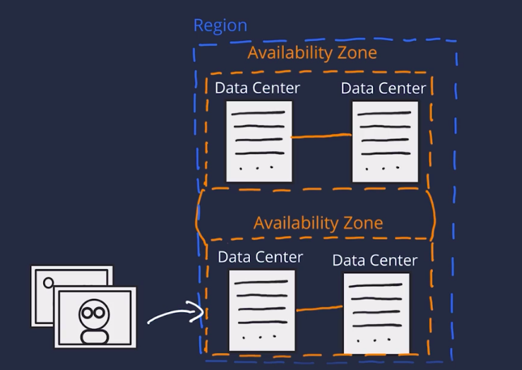

# Index
- [Index](#index)
- [Basics](#basics)
  - [AWS Business Model](#aws-business-model)
  - [What is Cloud Computing](#what-is-cloud-computing)
  - [Cloud Computing Models](#cloud-computing-models)
    - [In terms of Services offered](#in-terms-of-services-offered)
      - [Infrastructure as a Service (IaaS)](#infrastructure-as-a-service-iaas)
      - [Platform as a Service (PaaS)](#platform-as-a-service-paas)
      - [Software as a Service (SaaS)](#software-as-a-service-saas)
    - [In terms of deployment](#in-terms-of-deployment)
      - [Cloud](#cloud)
      - [Hybrid](#hybrid)
      - [On-premises](#on-premises)
- [Some of the advantages of AWS](#some-of-the-advantages-of-aws)
- [Common Amazon Services](#common-amazon-services)
  - [Compute](#compute)
  - [AWS Data-Storage](#aws-data-storage)
    - [AWS Storage](#aws-storage)
    - [AWS Databases](#aws-databases)
  - [Networking](#networking)
  - [Analytics](#analytics)
  - [Blockchain](#blockchain)
  - [Containers](#containers)
  - [Machine Learning](#machine-learning)
  - [IOT](#iot)
- [Overview of an app on AWS](#overview-of-an-app-on-aws)
- [Global Infrastructure of AWS](#global-infrastructure-of-aws)
  - [Availability Zone](#availability-zone)
  - [Region](#region)
    - [How to chose region](#how-to-chose-region)
- [Interacting with AWS](#interacting-with-aws)
  - [Security and AWS Shared Responsibility Model](#security-and-aws-shared-responsibility-model)
    - [AWS responsibility](#aws-responsibility)
    - [Customer responsibility](#customer-responsibility)
  - [Root User](#root-user)
    - [Access Keys](#access-keys)
    - [MFA](#mfa)
  - [IAM](#iam)
    - [Credentials](#credentials)
    - [IAM Group](#iam-group)
    - [IAM policies](#iam-policies)
    - [Policy Structure](#policy-structure)
  - [Important IAM best practices](#important-iam-best-practices)
    - [Lock down the AWS root user](#lock-down-the-aws-root-user)
    - [Principle of least privilege](#principle-of-least-privilege)
    - [Use IAM appropriately](#use-iam-appropriately)
    - [Use IAM roles when Possible](#use-iam-roles-when-possible)
    - [Consider using a Identity Provider](#consider-using-a-identity-provider)
    - [Consider AWS Single Sign-On](#consider-aws-single-sign-on)
  - [Key Takeaway](#key-takeaway)
- [AWS Compute](#aws-compute)
  - [Amazon Elastic Compute Cloud, EC2](#amazon-elastic-compute-cloud-ec2)
    - [Amazon Machine Image](#amazon-machine-image)
    - [Relationship between AMIs and EC2 instances](#relationship-between-amis-and-ec2-instances)
    - [AMI categories](#ami-categories)
    - [EC2 Instance](#ec2-instance)
      - [Amazon EC2 instance types](#amazon-ec2-instance-types)
      - [Instance families](#instance-families)
      - [EC2 instance locations](#ec2-instance-locations)
      - [Architect for high availability](#architect-for-high-availability)
      - [EC2 instance lifecycle](#ec2-instance-lifecycle)
      - [Difference between stop and stop-hibernate](#difference-between-stop-and-stop-hibernate)
      - [Price](#price)
      - [Pay as you go with On-Demand Instances](#pay-as-you-go-with-on-demand-instances)
      - [Reserve capacity with Reserved Instances (RIs)](#reserve-capacity-with-reserved-instances-ris)
      - [Save on costs with Spot Instances](#save-on-costs-with-spot-instances)
  - [Container Services](#container-services)
    - [Containers](#containers-1)
    - [Docker](#docker)
    - [Difference between containers and virtual machines (VMs)](#difference-between-containers-and-virtual-machines-vms)
    - [Orchestrate containers](#orchestrate-containers)
    - [Manage containers with Amazon Elastic Container Service (Amazon ECS)](#manage-containers-with-amazon-elastic-container-service-amazon-ecs)
    - [Use Kubernetes with Amazon Elastic Kubernetes Service (Amazon EKS)](#use-kubernetes-with-amazon-elastic-kubernetes-service-amazon-eks)
  - [Serverless and Lambda](#serverless-and-lambda)
    - [Remove the undifferentiated heavy lifting](#remove-the-undifferentiated-heavy-lifting)
    - [Go serverless](#go-serverless)
    - [Explore serverless containers with AWS Fargate](#explore-serverless-containers-with-aws-fargate)
    - [Run code on AWS Lambda](#run-code-on-aws-lambda)
    - [How AWS Lambda works](#how-aws-lambda-works)
    - [AWS Lambda function handler](#aws-lambda-function-handler)
    - [Naming](#naming)
    - [Billing granularity](#billing-granularity)
    - [Source code](#source-code)
- [Subtleties](#subtleties)
  - [IAM User vs IAM Role](#iam-user-vs-iam-role)

# Basics

## AWS Business Model

> Less I use the less I pay, the more I use the less I pay per unit

## What is Cloud Computing 

> Cloud computing is the on-demand delivery of IT resources over the Internet with pay-as-you-go pricing

## Cloud Computing Models

### In terms of Services offered

#### Infrastructure as a Service (IaaS)

#### Platform as a Service (PaaS)

#### Software as a Service (SaaS)

### In terms of deployment 

#### Cloud
#### Hybrid
#### On-premises


# Some of the advantages of AWS

- **Trade fixed expense for variable expense** – Instead of having to invest heavily in data centers and servers before you know how you’re going to use them, you can pay only when you consume computing resources, and pay only for how much you consume.

- **Benefit from massive economies of scale** – By using cloud computing, you can achieve a lower variable cost than you can get on your own. Because usage from hundreds of thousands of customers is aggregated in the cloud, providers such as AWS can achieve higher economies of scale, which translates into lower pay as-you-go prices.

- **Stop guessing capacity** – Eliminate guessing on your infrastructure capacity needs. When you make a capacity decision prior to deploying an application, you often end up either sitting on expensive idle resources or dealing with limited capacity. With cloud computing, these problems go away. You can access as much or as little capacity as you need, and scale up and down as required with only a few minutes’ notice.

- **Increase speed and agility** – In a cloud computing environment, new IT resources are only a click away, which means that you reduce the time to make those resources available to your developers from weeks to just minutes. This results in a dramatic increase in agility for the organization, since the cost and time it takes to experiment and develop is significantly lower.

- **Stop spending money running and maintaining data centers** – Focus on projects that differentiate your business, not the infrastructure. Cloud computing lets you focus on your own customers, rather than on the heavy lifting of racking, stacking, and powering servers.

- **Go global in minutes** – Easily deploy your application in multiple regions around the world with just a few clicks. This means you can provide lower latency and a better experience for your customers at minimal cost.


# Common Amazon Services

## Compute
- EC2
- AWS Lambda
- Amazon Lightsail
- Batch
- Elastic Beanstalk
- Serverless Application Repository

## AWS Data-Storage
AWS data-storage services are grouped into two main service groups: 
- AWS storage 
- AWS database.

### AWS Storage
- Amazon S3
- EBS
- S3 Glacier
- Elastic File Storage
- EBS

### AWS Databases
- Amazon RDS
- DynamoDB
- Redshift

## Networking
- Amazon VPC
- Amazon Route 53
- Elastic Load Balancing

## Analytics
## Blockchain
## Containers
## Machine Learning
## IOT


# Overview of an app on AWS

- Application is built in private network Amazon VPC (Virtual Private Cloud)
- Backend code is hosted on Amazon EC2 (Elastic Computer Cloud), it provides computing power/resources
- Users data is hosted on either Amazon RDS (Relational Database Service) DB Instance or Amazon DynamoDB
- Images will be stored in object storage service Amazon S3 (Simple Storage Service)
- To make application scalable and fault tolerant ELB (Elastic Load Balancer) is used
  - It distributes traffic across the EC2 instances
- Amazon EC2 autoscaling is used to scale down or scale up according to the demand
- For security and Identity we can use AWS IAM (Identity and Access Management)
- Amazon CloudWatch is used for monitoring the solution


# Global Infrastructure of AWS

## Availability Zone

- Cluster of data centers (1 or more data center(s)) with redundant power, networking, connectivity and data are called `Availability Zone`
- AZ is there to deal with natural disasters, if one data center goes down other should be there
- AZs also have a code name. Since they are located inside Regions, they can be addressed by appending a letter to the end of the Region code name
  - **sa-east-1b:** An AZ in sa-east-1 (São Paulo Region)

## Region
- Cluster of AZ's with Redundant high speed and low latency links is called `Region`
- Regions are generally named by location
- Each AWS Region is associated with a geographical name and a Region code.
  -  ap-northeast-1: The first Region created in the northeast Asia Pacific area. The geographical name for this Region is Tokyo.
-  AWS Regions are independent from one another. Data is not replicated from one Region to another, without explicit customer consent and authorization.

> A well-known best practice for cloud architecture is to use Region-scoped, managed services

### How to chose region

You should see these 4 things

- Compliance
  - Some countries or higher authorities requires companies to handle data in certain way, they might not allow to store their data in countries they don't have good relations with
- Latency
  - Distance of data centers from the users of data can affect latency
- Price
  - Data centers in some regions can be expensive than others due to the economy/tax structure
- Service Availability





# Interacting with AWS

Every action you make in AWS is an API call that is authenticated and authorized

- The AWS Management Console
- The AWS Command Line Interface (AWS CLI)
- AWS SDKs

## Security and AWS Shared Responsibility Model

managing security and compliance is a shared responsibility between AWS and you. To depict this shared responsibility, AWS created the shared responsibility model. The distinction of responsibility is commonly referred to as security OF the cloud versus security IN the cloud. 


### AWS responsibility


> The level of responsibility AWS has depends on the service. AWS classifies services into three categories.

<table style="width:100%;"><thead><tr><th style="width:20.9388%;background-color:rgb(0, 82, 118);"><span style="color:rgb(255, 255, 255);font-weight:bold;">Category</span></th><th style="width:42.4894%;background-color:rgb(0, 82, 118);"><span style="color:rgb(255, 255, 255);font-weight:bold;">Examples of AWS Services in the Category&nbsp;</span></th><th style="width:36.4856%;background-color:rgb(0, 82, 118);"><span style="color:rgb(255, 255, 255);font-weight:bold;">AWS Responsibility&nbsp;</span></th></tr></thead><tbody><tr><td style="text-align:center;width:20.9388%;"><span>Infrastructure services&nbsp;</span></td><td style="text-align:center;width:42.4894%;"><span>Compute services, such as Amazon Elastic Compute Cloud (Amazon EC2)&nbsp;</span></td><td style="text-align:center;width:36.4856%;"><span>AWS manages the underlying infrastructure and foundation services.&nbsp;</span></td></tr><tr><td style="text-align:center;width:20.9388%;"><span>Container services&nbsp;</span></td><td style="text-align:center;width:42.4894%;"><span>Services that require less management from the customer, such as Amazon Relational Database Service (Amazon RDS)&nbsp;</span></td><td style="text-align:center;width:36.4856%;"><span>AWS manages the underlying infrastructure and foundation services, operating system, and application platform.&nbsp;</span></td></tr><tr><td style="text-align:center;width:20.9388%;">Abstracted services<br></td><td style="text-align:center;width:42.4894%;">Services that require very little management from the customer, such as Amazon Simple Storage Service (Amazon S3)<br></td><td style="text-align:center;width:36.4856%;">AWS operates the infrastructure layer, operating system, and platforms, in addition to server-side encryption and data protection.<br></td></tr>

### Customer responsibility

<div class="rise-table-wrap"><table style="width:100%;"><thead><tr><th style="width:22.9099%;background-color:rgb(0, 82, 118);"><span style="color:rgb(255, 255, 255);font-weight:bold;">Category</span></th><th style="width:39.0728%;background-color:rgb(0, 82, 118);"><span style="color:rgb(255, 255, 255);font-weight:bold;">AWS Responsibility&nbsp;</span></th><th style="width:37.7997%;background-color:rgb(0, 82, 118);"><span style="color:rgb(255, 255, 255);font-weight:bold;">Customer Responsibility&nbsp;</span></th></tr></thead><tbody><tr><td style="text-align:center;width:22.9099%;"><span>Infrastructure services&nbsp;</span></td><td style="text-align:center;width:39.0728%;"><span>AWS manages the infrastructure and foundation services.&nbsp;</span></td><td style="text-align:center;width:37.7997%;"><span>You control the operating system and application platform, in addition to encrypting, protecting, and managing customer data.&nbsp;</span></td></tr><tr><td style="text-align:center;width:22.9099%;"><span>Container services&nbsp;</span></td><td style="text-align:center;width:39.0728%;"><span>AWS manages the infrastructure and foundation services, operating system, and application platform.&nbsp;</span></td><td style="text-align:center;width:37.7997%;"><span>You are responsible for customer data, encrypting the data, and protecting it through network firewalls and backups.&nbsp;</span></td></tr><tr><td style="text-align:center;width:22.9099%;">Abstracted services<br></td><td style="text-align:center;width:39.0728%;">AWS operates the infrastructure layer, operating system, and platforms, in addition to server-side encryption and data protection.<br></td><td style="text-align:center;width:37.7997%;">You are responsible for managing customer data and protecting it through client-side encryption.<br></td></tr>

## Root User
When you first create an AWS account, you begin with a single sign-in identity that has complete access to all AWS services and resources in the account. This identity is called the AWS root user and is accessed by signing in with the email address and password that you used to create the account. 

> email address and password allows you to access the AWS Management Console. 

### Access Keys
- allow you to make programmatic requests from the AWS Command Line Interface (AWS CLI) or AWS API.
- onsist of two parts:
  - Access key ID, for example, A2lAl5EXAMPLE
  - Secret access key, for example, wJalrFE/KbEKxE
- you need both the access key ID and secret access key to authenticate your requests via the AWS CLI or AWS API


> Disable or delete the access keys associated with the root user
> Do not use the root user for administrative tasks or everyday tasks


### MFA

<table style="width:100%;"><thead><tr><th style="width:22.1214%;background-color:rgb(0, 82, 118);"><span style="color:rgb(255, 255, 255);font-weight:bold;">Device&nbsp;</span></th><th style="width:48.2712%;background-color:rgb(0, 82, 118);"><span style="color:rgb(255, 255, 255);font-weight:bold;">Description&nbsp;</span></th><th style="width:29.5212%;background-color:rgb(0, 82, 118);"><span style="color:rgb(255, 255, 255);font-weight:bold;">Supported Devices&nbsp;</span></th></tr></thead><tbody><tr><td style="text-align:center;width:22.1214%;"><span>Virtual MFA&nbsp;</span></td><td style="text-align:center;width:48.2712%;"><span>A software app that runs on a phone or other device that provides a one-time passcode. These applications can run on unsecured mobile devices, and because of that, they might not provide the same level of security as hardware or U2F devices.&nbsp;</span></td><td style="text-align:center;width:29.5212%;"><span>Authy, Duo Mobile, LastPass Authenticator, Microsoft Authenticator, Google Authenticator&nbsp;</span></td></tr><tr><td style="text-align:center;width:22.1214%;"><span>Hardware</span></td><td style="text-align:center;width:48.2712%;"><span>A hardware device, generally a key fob or display card device, that generates a one-time, six-digit numeric code.</span></td><td style="text-align:center;width:29.5212%;"><span>Key fob, display card&nbsp;</span></td></tr><tr><td style="text-align:center;width:22.1214%;">U2F<br></td><td style="text-align:center;width:48.2712%;">A hardware device that you plug in to a USB port on your computer.<br></td><td style="text-align:center;width:29.5212%;">YubiKey<br></td></tr></tbody></table>

## IAM

AWS Identity and Access Management (IAM) is an AWS service that helps you manage access to your AWS account and resources. It also provides a centralized view of who and what are allowed inside your AWS account (authentication), and who and what have permissions to use and work with your AWS resources (authorization).

- IAM is global and not specific to any one Region. You can see and use your IAM configurations from any Region in the AWS Management Console.
- IAM is integrated with many AWS services by default.
- You can establish password policies in IAM to specify complexity requirements and mandatory rotation periods for users.
- IAM supports MFA.
- IAM supports identity federation, which allows users who already have passwords elsewhere – for example, in your corporate network or with an internet identity provider – to get temporary access to your AWS account.
- Any AWS customer can use IAM; the service is offered at no additional charge.


### Credentials
> An `IAM User` consists of a name and a set of credentials. 

When you create a user, you can provide them with the following types of access:

- Access to the AWS Management Console
- Programmatic access to the AWS Command Line Interface (AWS CLI) and AWS application programming interface (AWS API)

To access the AWS Management Console, provide the user with a user name and password. For programmatic access, AWS generates a set of access keys that can be used with the AWS CLI and AWS API. IAM user credentials are considered permanent, which means that they stay with the user until there’s a forced rotation by admins.

When you create an IAM user, you can grant permissions directly at the user level. This can seem like a good idea if you have only one or a few users. However, as the number of users increases, keeping up with permissions can become more complicated. For example, if you have 3,000 users in your AWS account, administering access and getting a top-level view of who can perform what actions on which resources can be challenging.

### IAM Group

- A new developer joins your AWS account to help with your application. You create a new user and add them to the developer group, without thinking about which permissions they need.
- A developer changes jobs and becomes a security engineer. Instead of editing the user’s permissions directly, you remove them from the old group and add them to the new group that already has the correct level of access.

> Users can belong to many groups.
> Groups cannot belong to groups.

### IAM policies
To manage access and provide permissions to AWS services and resources, you create IAM policies and attach them to IAM users, groups, and roles.


Most policies are stored in AWS as JSON documents with several policy elements. The following example provides admin access through an IAM identity-based policy.

```js
{
"Version": "2012-10-17",
"Statement": [{
"Effect": "Allow",
"Action": "*",
"Resource": "*"
}]
}
```


- The **Version** element defines the version of the policy language. It specifies the language syntax rules that are needed by AWS to process a policy. To use all the available policy features, include "Version": "2012-10-17" before the "Statement" element in your policies.
- The **Effect** element specifies whether the statement will allow or deny access. In this policy, the Effect is "Allow", which means you’re providing access to a particular resource.
- The **Action** element describes the type of action that should be allowed or denied. In the example policy, the action is "*". This is called a wildcard, and it is used to symbolize every action inside your AWS account.
- The **Resource** element specifies the object or objects that the policy statement covers. In the policy example, the resource is the wildcard "*". This represents all resources inside your AWS console.


```js

{
"Version": "2012-10-17",
"Statement": [{
"Effect": "Allow",
"Action": [
"iam: ChangePassword",
"iam: GetUser"
]
"Resource": "arn:aws:iam::123456789012:user/${aws:username}"
}]
}
```

> After looking at the JSON, you can see that this policy allows the IAM user to change their own IAM password (**iam:ChangePassword**) and get information about their own user (**iam:GetUser**). It only permits the user to access their own credentials because the resource restricts access with the variable substitution ${**aws:username**}.

### Policy Structure

<table style="width:100%;"><thead><tr><th style="width:12.0688%;background-color:rgb(0, 82, 118);text-align:left;"><span style="color:rgb(255, 255, 255);font-weight:bold;">Element</span></th><th style="width:46.2344%;background-color:rgb(0, 82, 118);"><span style="color:rgb(255, 255, 255);font-weight:bold;">Description</span></th><th style="width:9.7446%;background-color:rgb(0, 82, 118);"><span style="color:rgb(255, 255, 255);font-weight:bold;">Required&nbsp;</span></th><th style="width:31.0324%;background-color:rgb(0, 82, 118);"><span style="color:rgb(255, 255, 255);font-weight:bold;">Example</span></th></tr></thead><tbody><tr><td style="text-align:left;width:12.0688%;"><span><em><strong>Effect</strong></em></span></td><td style="text-align:center;width:46.2344%;"><span>Specifies whether the statement results in an allow or an explicit deny</span></td><td style="text-align:center;width:9.7446%;"><span><strong>√</strong></span><br></td><td style="text-align:center;width:31.0324%;"><span><em><strong>"Effect": "Deny"&nbsp;</strong></em></span></td></tr><tr><td style="text-align:left;width:12.0688%;"><em><strong>Action</strong></em><br></td><td style="text-align:center;width:46.2344%;">Describes the specific actions that will be allowed or denied</td><td style="text-align:center;width:9.7446%;"><span><strong>√</strong></span></td><td style="text-align:center;width:31.0324%;"><span><em><strong>"Action": "iam:CreateUser"</strong></em></span></td></tr><tr><td style="text-align:left;width:12.0688%;"><em><strong>Resource</strong></em><br></td><td style="text-align:center;width:46.2344%;">Specifies the object or objects that the statement covers<br></td><td style="text-align:center;width:9.7446%;"><strong>√</strong><br></td><td style="text-align:center;width:31.0324%;"><em><strong>"Resource": "arn:aws:iam::account-ID-without-hyphens:user/Bob"</strong></em><br></td></tr></tbody></table>


## Important IAM best practices

### Lock down the AWS root user

The root user is an all-powerful and all-knowing identity in your AWS account. If a malicious user were to gain control of root-user credentials, they would be able to access every resource in your account, including personal and billing information. To lock down the root user, you can do the following:

- Don’t share the credentials associated with the root user
- Consider deleting the root user access keys
- Enable MFA on the root account

### Principle of least privilege

Least privilege is a standard security principle that advises you to grant only the necessary permissions to do a particular job and nothing more. To implement least privilege for access control, start with the minimum set of permissions in an IAM policy and then grant additional permissions as necessary for a user, group, or role.

### Use IAM appropriately

IAM is used to secure access to your AWS account and resources. It simply provides a way to create and manage users, groups, and roles to access resources in a single AWS account. IAM is not used for website authentication and authorization, such as providing users of a website with sign-in and sign-up functionality. IAM also does not support security controls for protecting operating systems and networks.

### Use IAM roles when Possible

Maintaining roles is more efficient than maintaining users. When you assume a role, IAM dynamically provides temporary credentials that expire after a defined period of time, between 15 minutes and 36 hours. Users, on the other hand, have long-term credentials in the form of user name and password combinations or a set of access keys.

User access keys only expire when you or the account admin rotates the keys. User login credentials expire if you applied a password policy to your account that forces users to rotate their passwords.

### Consider using a Identity Provider
If you decide to make your cat photo application into a business and begin to have more than a handful of people working on it, consider managing employee identity information through an **Identity Provider (IdP)**. Using an IdP, whether it's an AWS service such as AWS Single Sign-On or a third-party identity provider, provides a single source of truth for all identities in your organization.

You no longer have to create separate IAM users in AWS. You can instead use IAM roles to provide permissions to identities that are federated from your IdP. For example, you have an employee, Martha, who has access to multiple AWS accounts. Instead of creating and managing multiple IAM users named Martha in each of those AWS accounts, you could manage Martha in your company’s IdP. If Martha moves in the company or leaves the company, Martha can be updated in the IdP, rather than in every AWS account in the company.

### Consider AWS Single Sign-On
If you have an organization that spans many employees and multiple AWS accounts, you might want your employees to sign in with a single credential.

AWS SSO is an IdP that lets your users sign in to a user portal with a single set of credentials. It then provides users access to their assigned accounts and applications in a central location.

Similar to IAM. AWS SSO offers a directory where you can create users, organize them in groups, set permissions across the groups, and grant access to AWS resources. However, AWS SSO has some advantages over IAM. For example, if you’re using a third-party IdP, you can sync your users and groups to AWS SSO. This removes the burden of having to re-create users that already exist elsewhere, and it enables you to manage the users from your IdP. More importantly, AWS SSO separates the duties between your IdP and AWS, ensuring that your cloud access management is not inside or dependent on your IdP.

## Key Takeaway

**We don't hard code credentials**


**IAM Roles**


**You won't make hundreds/dozens of roles**

Should You make IAM User for each user, you can but you can leverage IAM Roles to grant access to existing identities from your enterprise user directory through Identity Provider

AWS assigns a role to Federated User when access is requested through Identity Provider.
AWS Single SignOn make such process easier


# AWS Compute
At a fundamental level, three types of compute options are available 
- virtual machines (VMs)
  - Amazon Elastic Compute Cloud / EC2
    - a virtual machine emulates a physical server and allows you to install an HTTP server to run your applications
    - To run virtual machines, you install a hypervisor
    - AWS operates and manages the host machines and the hypervisor layer
- container services
- serverless

## Amazon Elastic Compute Cloud, EC2
> secure, resizable compute capacity in the cloud

To create an EC2 instance, you must define the following:
- Hardware specifications, like CPU, memory, network, and storage
- Logical configurations, like networking location, firewall rules, authentication, and the operating system of your choice

When launching an EC2 instance, the first setting you configure is which operating system you want by selecting an Amazon Machine Image (AMI).

### Amazon Machine Image

> An Amazon Machine Image (AMI) is a template that contains a software configuration (for example, an operating system, an application server, and applications). From an AMI, you launch an instance, which is a copy of the AMI running as a virtual server in the cloud. You can launch multiple instances of an AMI, as shown in the following figure.


In the traditional infrastructure world, the process of spinning up a server consists of installing an operating system from installation disks, installation drives, or installation wizards over the network. In the AWS Cloud, the operating system installation is not your responsibility. Instead, it's built into the AMI that you choose.
In addition, when you use an AMI, you can select storage mappings, the architecture type (such as 32-bit, 64-bit, or 64-bit ARM), and additional software installed.

### Relationship between AMIs and EC2 instances

> EC2 instances are live instantiations of what is defined in an AMI, much like a cake is a live instantiation of a cake recipe. 
> AMI is how you model and define your instance, while the EC2 instance is the entity you interact with, where you can install your web server and serve your content to users.


### AMI categories
You can select an AMI from the following categories:

- Quick Start AMIs, which are created by AWS to help you get started quickly
- AWS Marketplace AMIs, which provide popular open source and commercial software from third-party vendors
- My AMIs, which are created from your EC2 instances
- Community AMIs, which are provided by the AWS user community
- Build your own custom image with EC2 Image Builder

> Each AMI in the AWS Management Console has an AMI ID, which is prefixed by “ami-”, followed by a random hash of numbers and letters. The IDs are unique to each AWS Region

### EC2 Instance

> An instance is a virtual server in the cloud. Its configuration at launch is a copy of the AMI that you specified when you launched the instance.


#### Amazon EC2 instance types

Amazon EC2 instances are a combination of virtual processors (vCPUs), memory, network, and, in some cases, instance storage and graphics processing units (GPUs). When you create an EC2 instance, you need to choose how much you need of each of these components.


AWS offers a variety of instances that differ based on performance. Some instances provide more capacity than others. To get an overview of the capacity details for a particular instance, you should look at the instance type. Instance types consist of a prefix identifying the type of workloads they’re optimized for, followed by a size. For example, the instance type c5.large can be broken down as follows:

- **c5** determines the instance family and generation number. Here, the instance belongs to the fifth generation of instances in an instance family that’s optimized for generic computation.
- **large** determines the amount of instance capacity.

#### Instance families

In the example c5.large, the first letter, c, stands for compute-optimized. Compute optimized is one of the many instance families that AWS offers. Each instance family is optimized to fit different use cases. The following table describes instance families and some typical workloads.

<table style="width:100%;"><thead><tr><th style="width:17.4565%;background-color:rgb(0, 82, 118);"><span style="color:rgb(255, 255, 255);font-weight:bold;">Instance Family</span></th><th style="width:40.8468%;background-color:rgb(0, 82, 118);"><span style="color:rgb(255, 255, 255);font-weight:bold;">Description</span></th><th style="width:41.6762%;background-color:rgb(0, 82, 118);"><span style="color:rgb(255, 255, 255);font-weight:bold;">Use Cases</span></th></tr></thead><tbody><tr><td style="text-align:justify;width:17.4565%;"><span>General purpose</span></td><td style="text-align:left;width:40.8468%;"><span>Provides a balance of compute, memory, and networking resources, and can be used for a variety of workloads.</span></td><td style="text-align:left;width:41.6762%;"><span>Scale out workloads, such as web servers, containerized microservices, caching fleets, distributed data stores, and development environments</span></td></tr><tr><td style="text-align:justify;width:17.4565%;"><span>Compute optimized</span></td><td style="text-align:left;width:40.8468%;"><span>Ideal for compute-bound applications that benefit from high-performance processors.</span></td><td style="text-align:left;width:41.6762%;"><span>High-performance web servers, scientific modeling, batch processing, distributed analytics, high-performance computing (HPC), machine/deep learning, ad serving, highly scalable multiplayer gaming</span></td></tr><tr><td style="text-align:justify;width:17.4565%;">Memory optimized<br></td><td style="text-align:left;width:40.8468%;">Designed to deliver fast performance for workloads that process large datasets in memory.<br></td><td style="text-align:left;width:41.6762%;">Memory-intensive applications, such as high-performance databases, distributed web-scale in-memory caches, mid-size in-memory databases, real-time big-data analytics, and other enterprise applications<br></td></tr><tr><td style="text-align:justify;width:17.4565%;">Accelerated computing<br></td><td style="text-align:left;width:40.8468%;">Use hardware accelerators or co-processors to perform functions such as floating-point number calculations, graphics processing, or data pattern matching more efficiently than is possible with conventional CPUs.<br></td><td style="text-align:left;width:41.6762%;">3D visualizations, graphics-intensive remote workstations, 3D rendering, application streaming, video encoding, and other server-side graphics workloads<br></td></tr><tr><td style="text-align:justify;width:17.4565%;">Storage optimized<br></td><td style="text-align:left;width:40.8468%;">Designed for workloads that require high, sequential read and write access to large datasets on local storage. They are optimized to deliver tens of thousands of low-latency random I/O operations per second (IOPS) to applications that replicate their data across different instances.<br></td><td style="text-align:left;width:41.6762%;">NoSQL databases, such as Cassandra, MongoDB, and Redis, in-memory databases, scale-out transactional databases, data warehousing, Elasticsearch, and analytics<br></td></tr></tbody></table>

#### EC2 instance locations

By default, your EC2 instances are placed in a network called the default Amazon Virtual Private Cloud (Amazon VPC). This network was created so that you can easily get started with Amazon EC2 without learning how to create and configure a VPC.

Any resource you put inside the default VPC will be public and accessible by the internet, so you shouldn’t place any customer data or private information in it.

Once you get more comfortable with networking on AWS, you should change this default setting to choose your own custom VPCs and restrict access with additional routing and connectivity mechanisms.

#### Architect for high availability

In the network, your instance resides in an Availability Zone of your choice. As you learned previously, AWS services that are scoped at the Availability Zone level must be architected with high availability in mind.

While EC2 instances are typically reliable, two is better than one, and three is better than two. Specifying the instance size gives you an advantage when designing your architecture because you can use more smaller instances rather than a few larger ones.

If your front end only has a single instance and the instance fails, your application goes down. On the other hand, if your workload is distributed across 10 instances and one fails, you lose only 10 percent of your fleet, and your application availability is hardly affected.

When architecting any application for high availability, consider using at least two EC2 instances in two separate Availability Zones. ­­

#### EC2 instance lifecycle

An EC2 instance transitions between different states from the moment you create it until it's termination.


1. When you launch an instance, it enters the **pending** state. When an instance is pending, billing has not started. At this stage, the instance is preparing to enter the running state. Pending is where AWS performs all actions needed to set up an instance, such as copying the AMI content to the root device and allocating the necessary networking components.
2. When your instance is running, it's ready to use. This is also the stage where billing begins. As soon as an instance is running, you can take other actions on the instance, such as reboot, terminate, stop, and stop-hibernate.
3. When you reboot an instance, it’s different than performing a stop action and then a start action. Rebooting an instance is equivalent to **rebooting** an operating system. The instance remains on the same host computer, and maintains its public and private IP address, in addition to any data on its instance store.
4. It typically takes a few minutes for the reboot to complete. When you stop and start an instance, your instance may be placed on a new underlying physical server. Therefore, you lose any data on the instance store that were on the previous host computer. When you stop an instance, the instance gets a new public IP address but maintains the same private IP address.
5. When you terminate an instance, the instance stores are erased, and you lose both the public IP address and private IP address of the machine. Termination of an instance means that you can no longer access the machine.

#### Difference between stop and stop-hibernate

When you stop an instance, it enters the stopping state until it reaches the stopped state. AWS does not charge usage or data transfer fees for your instance after you stop it, but storage for any Amazon EBS volumes is still charged. While your instance is in the stopped state, you can modify some attributes, like the instance type. When you stop your instance, the data stored in memory (RAM) is lost.

When you stop-hibernate an instance, AWS signals the operating system to perform hibernation (suspend-to-disk), which saves the contents from the instance memory (RAM) to the Amazon EBS root volume.

Consider a scenario where you build a standard three-tier application, where you have web servers, application servers, and database servers. Suddenly, the application you built becomes extremely popular. To relieve some stress on the database that supports your application, you want to implement a custom backend layer that caches database information in memory (RAM). You decide to run this custom backend caching solution on Amazon EC2.

In this scenario, the stop-hibernate feature would be instrumental in persisting storage. It would prevent you from having to manually create scripts to save the RAM data before shutting down the server.

#### Price
One of the ways to reduce costs with Amazon EC2 is to choose the right pricing option for the way your applications run. AWS offers three main purchasing options for EC2 instances – On-Demand, Reserved, and Spot Instances.


#### Pay as you go with On-Demand Instances

With On-Demand Instances, you pay for compute capacity with no long-term commitments. Billing begins whenever the instance is running, and billing stops when the instance is in a stopped or terminated state. The price per second for a running On-Demand Instance is fixed.

For applications that require servers to be running all the time, you are less likely to benefit from the On-Demand pricing model, simply because there is no situation where you will need to turn servers off. For example, you might want the web server hosting the front end of your corporate directory application to be running 24/7 so that users can access the website at any time. Even if no users are connected to your website, you don’t want to shut down the servers supporting the site in case of potential user activity.

In the case when servers cannot be stopped, consider using a Reserved Instance to save on costs.


#### Reserve capacity with Reserved Instances (RIs)

RIs provide you with a significant discount compared to On-Demand Instance pricing. RIs provide a discounted hourly rate and an optional capacity reservation for EC2 instances. You can choose between three payment options – All Upfront, Partial Upfront, or No Upfront. You can select either a 1-year or 3-year term for each of these options.

Depending on which option you choose, you are discounted differently.

- **All Upfront** offers a higher discount than Partial Upfront instances.
- **Partial Upfront** instances offer a higher discount than No Upfront.
- **No Upfront** offers a higher discount than On-Demand.

On-Demand and No Upfront are similar, since both do not require any upfront payment. However, there is a major difference. When you choose an On-Demand Instance, you stop paying for the instance when you stop or terminate the instance. When you stop an RI, you still pay for it because you committed to a 1-year or 3-year term.

Reserved Instances are associated with an instance type and an Availability Zone depending on how you reserve it. The discount applied by a Reserved Instance purchase is not directly associated with a specific instance ID, but with an instance type.

#### Save on costs with Spot Instances

Another way to pay for EC2 instances is by using Spot Instances. Amazon EC2 Spot Instances allow you to take advantage of unused EC2 capacity in the AWS Cloud. They are available at up to a 90% discount compared to On-Demand prices.

With Spot Instances, you set a limit on how much you would like to pay for the instance hour. This is compared against the current Spot price that AWS determines. If the amount you pay is more than the current Spot price and there is capacity, then you will receive an instance. While they are very promising from the billing perspective, you must account for some architectural considerations to use them effectively.

One consideration is that your Spot Instance might be interrupted. For example, if AWS determines that capacity is no longer available for a particular Spot Instance or if the Spot price exceeds how much you are willing to pay, AWS will give you a 2-minute warning before it interrupts your instance. That means any application or workload that runs on a Spot Instance must be able to be interrupted.

Because of this unique consideration, inherently fault-tolerant workloads are typically good candidates to use with Spot Instances. These include big data, containerized workloads, continuous integration/continuous delivery (CI/CD), web servers, high-performance computing (HPC), image and media rendering, and other test and development workloads.

## Container Services

AWS offers a broad spectrum of compute offerings that give you the flexibility to choose the right tool for the job. The three main categories of compute are virtual machines (VMs), containers, and serverless. No one-size-fits-all compute service exists because it depends on your needs.

The key is to understand what each option offers. Then, you can build an appropriate cloud architecture for your use case. In this section, you will learn about containers and how to run them.

Containers can host a variety of different workloads, including web applications, lift and shift migrations, distributed applications, and streamlining of development, test, and production environments.

AWS offers a broad spectrum of compute offerings that give you the flexibility to choose the right tool for the job. The three main categories of compute are virtual machines (VMs), containers, and serverless. No one-size-fits-all compute service exists because it depends on your needs.

The key is to understand what each option offers. Then, you can build an appropriate cloud architecture for your use case. In this section, you will learn about containers and how to run them.

Containers can host a variety of different workloads, including web applications, lift and shift migrations, distributed applications, and streamlining of development, test, and production environments.


### Containers

While containers are often referred to as a new technology, the idea started in the 1970s with certain UNIX kernels having the ability to separate their processes through isolation. At the time, this was configured manually, making operations complex.

With the evolution of the open source software community, containers evolved. Today, containers are used as a solution to problems of traditional compute, including the issue of getting software to run reliably when it moves from one compute environment to another.

A container is a standardized unit that packages your code and its dependencies. This package is designed to run reliably on any platform, because the container creates its own independent environment. With containers, workloads can be carried from one place to another, such as from development to production or from on premises to the cloud.

### Docker

When you hear the word container, you might associate it with Docker. Docker is a popular container runtime that simplifies the management of the entire operating system stack needed for container isolation, including networking and storage. Docker helps customers create, package, deploy, and run containers.

### Difference between containers and virtual machines (VMs)


**Containers** share the same operating system and kernel as the host they exist on, whereas virtual machines contain their own operating system. Each virtual machine must maintain a copy of an operating system, which results in a degree of wasted resources.

A container is more lightweight. They spin up quicker, almost instantly. This difference in startup time becomes instrumental when designing applications that need to scale quickly during input/output (I/O) bursts.

While containers can provide speed, virtual machines offer the full strength of an operating system and more resources, like package installation, dedicated kernel, and more.

### Orchestrate containers
In AWS, containers run on EC2 instances. For example, you might have a large instance and run a few containers on that instance. While running one instance is easy to manage, it lacks high availability and scalability. Most companies and organizations run many containers on many EC2 instances across several Availability Zones.

If you’re trying to manage your compute at a large scale, you must know the following:

- How to place your containers on your instances
- What happens if your container fails
- What happens if your instance fails
- How to monitor deployments of your containers

This coordination is handled by a container orchestration service. AWS offers two container orchestration services – Amazon Elastic Container Service (ECS) and Amazon Elastic Kubernetes Service (EKS).

### Manage containers with Amazon Elastic Container Service (Amazon ECS)

Amazon ECS is an end-to-end container orchestration service that helps you spin up new containers and manage them across a cluster of EC2 instances.


To run and manage your containers, you need to install the Amazon ECS container agent on your EC2 instances. This agent is open source and responsible for communicating to the Amazon ECS service about cluster management details. You can run the agent on both Linux and Windows AMIs. An instance with the container agent installed is often called a container instance.


Once the Amazon ECS container instances are up and running, you can perform actions that include, but are not limited to, launching and stopping containers, getting cluster state, scaling in and out, scheduling the placement of containers across your cluster, assigning permissions, and meeting availability requirements.

To prepare your application to run on Amazon ECS, you create a task definition. The task definition is a text file, in JSON format, that describes one or more containers. A task definition is similar to a blueprint that describes the resources you need to run a container, such as CPU, memory, ports, images, storage, and networking information.

Here is a simple task definition that you can use for your corporate directory application. In this example, this runs on the Nginx web server.

```js
{
"family": "webserver",
"containerDefinitions": [ {
"name": "web",
"image": "nginx",
"memory": "100",
"cpu": "99"
} ],
"requiresCompatibilities": [ "FARGATE" ],
"networkMode": "awsvpc",
"memory": "512",
"cpu": "256"
}
```

### Use Kubernetes with Amazon Elastic Kubernetes Service (Amazon EKS)

Kubernetes is a portable, extensible, open source platform for managing containerized workloads and services. By bringing software development and operations together by design, Kubernetes created a rapidly growing ecosystem that is very popular and well established in the market. 

If you already use Kubernetes, you can use Amazon EKS to orchestrate the workloads in the AWS Cloud. Amazon EKS is conceptually similar to Amazon ECS, but with the following differences:

- An EC2 instance with the ECS agent installed and configured is called a container instance. In Amazon EKS, it is called a worker node.
- An ECS container is called a task. In Amazon EKS, it is called a pod.
- While Amazon ECS runs on AWS native technology, Amazon EKS runs on top of Kubernetes.

If you have containers running on Kubernetes and want an advanced orchestration solution that can provide simplicity, high availability, and fine-grained control over your infrastructure, Amazon EKS could be the tool for you.

## Serverless and Lambda


### Remove the undifferentiated heavy lifting

If you run your code on Amazon EC2, AWS is responsible for the physical hardware, and you are responsible for the logical controls, such as guest operating system, security and patching, networking, security, and scaling.

If you run your code in containers on Amazon ECS and Amazon EKS, AWS is responsible for more of the container management, such as deploying containers across EC2 instances and managing the container cluster. However, when running ECS and EKS on EC2, you are still responsible for maintaining the underlying EC2 instances.

If you want to deploy your workloads and applications without having to manage any EC2 instances, you can do that on AWS with serverless compute.

### Go serverless

Every definition of serverless mentions the following four aspects:

- No servers to provision or manage
- Scales with usage
- You never pay for idle resources
- Availability and fault tolerance are built-in
With serverless, you can spend time on the things that differentiate your application, rather than spend time on ensuring availability, scaling, and managing servers.

AWS has several serverless compute options, including AWS Fargate and AWS Lambda.

### Explore serverless containers with AWS Fargate

Amazon ECS and Amazon EKS enable you to run your containers in the following two modes:

- Amazon EC2 mode
- AWS Fargate mode


AWS Fargate is a purpose-built serverless compute engine for containers. Fargate scales and manages the infrastructure, allowing developers to work on what they do best – application development. It achieves this by allocating the right amount of compute, eliminating the need to choose and handle EC2 instances and cluster capacity, and scaling. Fargate supports both Amazon ECS and Amazon EKS architecture, and provides workload isolation and improved security by design.

Fargate abstracts the EC2 instance so that you’re not required to manage it. However, with Fargate, you can use all the same ECS primitives, APIs, and AWS integrations. It natively integrates with AWS Identity and Access Management (IAM) and Amazon Virtual Private Cloud (VPC). Having native integration with Amazon VPC allows you to launch Fargate containers inside your network and control connectivity to your applications.

### Run code on AWS Lambda

If you want to deploy your workloads and applications without having to manage any EC2 instances or containers, you can use AWS Lambda.

With AWS Lambda, you can run code without provisioning or managing servers or containers. You can run code for virtually any type of application or backend service, including data processing, real-time stream processing, machine learning, WebSockets, IoT backends, mobile backends, and web apps, like your corporate directory app!

AWS Lambda requires zero administration from the user. You upload your source code, and Lambda takes care of everything required to run and scale your code with high availability. There are no servers to manage, bringing you continuous scaling with subsecond metering and consistent performance.

### How AWS Lambda works

A Lambda function has three primary components – trigger, code, and configuration. 


The code is source code that describes what the Lambda function should run. It can be authored in three ways.

- You create the code from scratch.
- You use a blueprint that AWS provides.
- You use some code from the AWS Serverless Application Repository, a resource that contains sample applications, such as “hello world” code, Amazon Alexa Skill sample code, image resizing code, video encoding, and more.
When you create your Lambda function, you specify the runtime you want your code to run in. You can use built-in runtimes, such as Python, Node.js, Ruby, Go, Java, or .NET Core, or you can implement your Lambda functions to run on a custom runtime.

The configuration of a Lambda function consists of information that describes how the function should run. In the configuration, you specify network placement, environment variables, memory, invocation type, permission sets, and other configurations. To dive deeper into these configurations, check out the resources section.

Triggers describe when a Lambda function should run. A trigger integrates your Lambda function with other AWS services, enabling you to run your Lambda function in response to certain API calls that occur in your AWS account. This increases your ability to respond to events in your console without having to perform manual actions. All you need is the what, how, and when of a Lambda function to have functional compute capacity that runs only when you need it to.

Amazon’s CTO, Werner Vogels, says, “No server is easier to manage than no server.” This quote summarizes the convenience you can have when running serverless solutions, like AWS Fargate and AWS Lambda. Later, you will apply all the information you have acquired about Amazon EC2, Amazon ECS, Amazon EKS, and AWS Fargate to some use cases for each service.

### AWS Lambda function handler

The AWS Lambda function handler is the method in your function code that processes events. When your function is invoked, Lambda runs the handler method. When the handler exits or returns a response, it becomes available to handle another event. 

You can use the following general syntax when creating a function handler in Python.

```js
def handler_name(event, context):
...
return some_value
```

### Naming

The Lambda function handler name specified at the time you create a Lambda function is derived from the following:

- Name of the file in which the Lambda handler function is located
- Name of the Python handler function
A function handler can be any name; however, the default on the Lambda console is lambda_function.lambda_handler. This name reflects the function name as lambda_handler, and the file where the handler code is stored in lambda_function.py. If you choose a different name for your function handler on the Lambda console, you must update the name on the Runtime settings pane.

### Billing granularity

AWS Lambda lets you run code without provisioning or managing servers, and you pay only for what you use. You are charged for the number of times your code is triggered (requests) and for the time your code executes, rounded up to the nearest 1 ms (duration).

AWS rounds up duration to the nearest millisecond with no minimum execution time. With this pricing, it can be cost effective to run functions whose execution time is very low, such as functions with durations under 100 ms or low latency APIs. Read more here: https://aws.amazon.com/blogs/aws/new-for-aws-lambda-1ms-billing-granularity-adds-cost-savings/

### Source code

You can find a tutorial on creating the AWS Lambda function as well as the code used in the AWS Lambda demo here: https://aws.amazon.com/blogs/compute/resize-images-on-the-fly-with-amazon-s3-aws-lambda-and-amazon-api-gateway/

# Subtleties

## IAM User vs IAM Role
- Instead of being uniquely associated with one person, a role is intended to be assumable by anyone who needs it. An IAM user can assume a role to temporarily take on different permissions for a specific task. A role can be assigned to a federated user who signs in by using an external identity provider instead of IAM.
- IAM Users have 
  - username 
  - password
  - static credentials
    - access key
    - secret access key
- IAM Roles 
  - don't have
    - username
    - password
  - credentials used to sign the request are programmatically acquired
  - temporary in nature
  - automatically rotated


